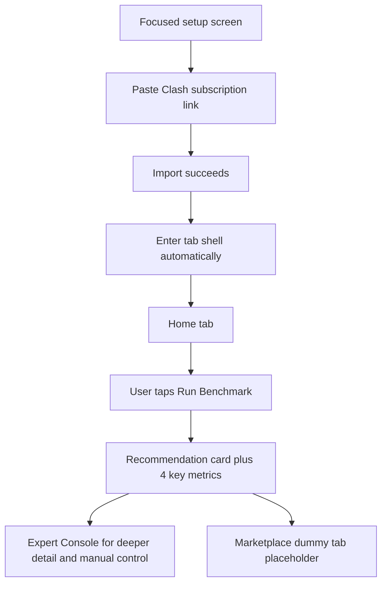

# RockeRoom V1 Product Reset

## Problem Frame

The current app shape is fighting the category instead of helping the user.

Right now RockeRoom opens with an Auto Mode-first story, hides subscription import behind a sheet, and pushes the user toward recommendation cards before they have basic trust in the benchmark loop. That is backwards for a Clash-style client. A user expects a normal setup flow, a visible benchmark action, and a clear place to inspect raw results and manual controls.

The v1 reset should make RockeRoom feel like a normal proxy client first, then layer recommendation logic on top of that. The product should earn automation through measured results, not ask for trust up front.

## Requirements

**Navigation and App Structure**
- R1. Before any subscription is imported, the app must show a focused setup screen instead of the normal tabbed app shell.
- R2. After a successful subscription import, the app must automatically enter the main tabbed app shell with no extra confirmation step.
- R3. The main app shell must use bottom tabs with exactly three tabs in v1: `Home`, `Expert Console`, and `Marketplace`.
- R4. `Home` must be the default landing tab after import and on normal app reopen.
- R5. `Marketplace` may exist as a dummy placeholder tab in v1, but it must not drive the main product loop or pretend to be complete.

**Import and First-Run Flow**
- R6. The setup screen must make Clash subscription import the primary first action, with a normal paste-friendly text input and a clear import button.
- R7. Subscription import must not depend on a modal sheet for the primary v1 flow.
- R8. After import succeeds, the user must land on `Home` in an unbenchmarked state with a clear call to action to run the benchmark.

**Benchmark Loop**
- R9. Benchmarking must be explicit and user-triggered in v1. The primary action on `Home` after import is `Run Benchmark`.
- R10. V1 must not auto-benchmark on import.
- R11. V1 must not run a continuous or background benchmarking loop. Re-measurement only happens when the user explicitly triggers it.
- R12. Recommendation logic may exist, but it must be downstream of a completed benchmark run rather than the app’s opening identity.

**Home Tab**
- R13. After a benchmark completes, `Home` must remain simple and summary-oriented rather than becoming a dense dashboard.
- R14. `Home` must show one primary recommendation card, not a full ranked list.
- R15. `Home` must expose exactly four key user-facing metrics in the summary view: `Latency`, `Jitter`, `Packet Loss`, and `Throughput`.
- R16. `Home` must not contain full manual node or provider selection controls in v1.
- R17. `Home` must make it obvious when the displayed recommendation is based on a benchmark result versus when no benchmark has been run yet.

**Expert Console**
- R18. `Expert Console` must be the place for deeper inspection, detailed metrics, and manual control rather than `Home`.
- R19. The exact top-level ranking model for `Expert Console` may be deferred, but the v1 product must reserve it as the tab where users expect ranked candidates and detailed benchmark evidence.
- R20. Any detailed metrics shown in `Expert Console` must be consistent with the metrics surfaced on `Home`, even if the presentation is denser.

**Trust and Product Language**
- R21. The app must present automation as something earned by measurement, not as unexplained magic.
- R22. The first-run and benchmark-complete states must use conventional UI flow and terminology that matches user expectations for this app category.
- R23. If a metric cannot be measured honestly or consistently enough for v1, the product must either clarify its meaning or remove it from user-facing claims rather than implying false precision.

## Success Criteria

- A new user can understand the core loop without explanation: import subscription, land on Home, run benchmark, see recommendation, inspect details if desired.
- A user can paste a Clash subscription link into the primary setup screen without hunting through a modal flow.
- The `Home` tab feels simple and legible rather than like a partial expert dashboard.
- `Expert Console` feels like the right place for deeper benchmark detail and manual control.
- The app’s automation story feels believable because it is visibly tied to benchmark results.

## Scope Boundaries

- No background or continuous benchmarking in v1.
- No full Marketplace functionality in v1 beyond a dummy placeholder tab.
- No requirement yet to finalize whether `Expert Console` ranks nodes, groups, or both.
- No requirement for manual selection controls on `Home`.
- No additional tabs beyond `Home`, `Expert Console`, and `Marketplace`.

## Key Decisions

- `Home-first normal flow`: The app should behave like a normal proxy client before asking the user to trust automation.
- `Explicit benchmark`: The first benchmark must be user-triggered to make the system legible and trustworthy.
- `Bottom tabs`: `Home`, `Expert Console`, and `Marketplace` are the correct top-level navigation model for v1.
- `Simple Home`: `Home` should show one recommendation card plus four key metrics, not a full control surface.
- `Dummy Marketplace`: Keep the Marketplace tab only as a placeholder in v1, not as a real product pillar.

## Dependencies / Assumptions

- Throughput remains in the `Home` metric set only if planning confirms it can be measured in a way that is stable enough for user-facing trust.
- The current benchmark and recommendation engine can be reshaped into this flow without requiring a different execution core.

## Outstanding Questions

### Resolve Before Planning

- None.

### Deferred to Planning

- [Affects R19][Technical] Should `Expert Console` rank individual nodes, proxy groups, or a layered model with both?
- [Affects R15][Needs research] How should `Throughput` be defined and measured so it is honest enough for the `Home` summary card?
- [Affects R5][Technical] Should the dummy `Marketplace` tab be a static placeholder view or a lightweight read-only teaser built from existing app state?

## Next Steps

→ /prompts:ce-plan for structured implementation planning
