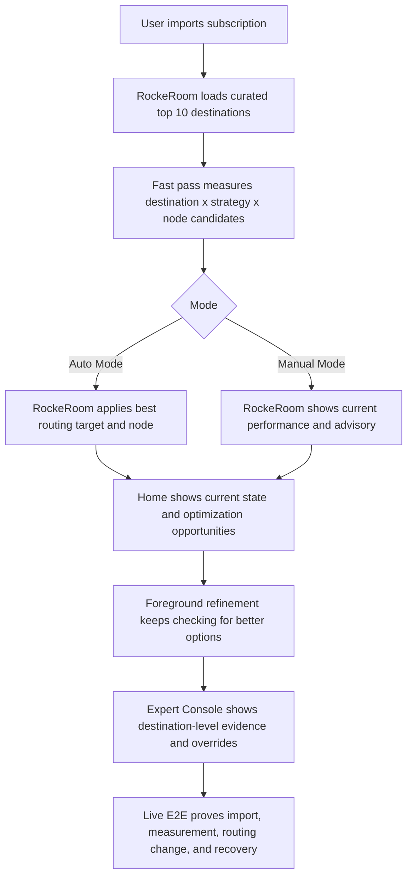

# Routing Optimization Core

## Problem Frame

RockeRoom's current loop can answer a narrower question: for one imported subscription on this device right now, which measured candidate looks best overall. That is useful, but it is not yet the core question advanced users actually care about.

The stronger product question is: for the destinations that matter on this device, what is the current performance, which routing strategy and node provider are currently in use, can that combination be improved, and should RockeRoom change routing automatically or leave control with the user.

The user wants RockeRoom to become the system that decides and validates routing for destinations like `OpenAI`, `Claude`, `Netflix`, `TikTok`, and `Apple`, not just a one-shot benchmark screen. That makes the live E2E plan part of the feature itself, because the product only matters if RockeRoom can repeatedly prove that measurement, routing decisions, and user-visible outcomes line up.

The repo's current observability memo in `docs/research/2026-04-04-ios-observability-spike.md` rules out pretending that RockeRoom has private per-app telemetry by default. So the product must use app names in the UI while defining them honestly as rule-backed destinations derived from curated routing packs, not direct inspection of arbitrary installed app traffic.

## Requirements

**Product Model**
- R1. RockeRoom must define its core value as routing optimization for a curated destination set, not only single-score node ranking.
- R2. The product must answer two user questions for each supported destination: `what is the current performance?` and `can this be optimized right now?`
- R2a. The product answer for a supported destination must include the current routing strategy and current node or provider assignment, not only an abstract score.
- R3. The UI may use app and service names such as `OpenAI`, `TikTok`, or `Netflix`, but those labels must be defined as rule-backed destinations rather than claims of private per-app traffic inspection.
- R4. User-facing copy and evidence surfaces must stay consistent with the current observability constraint documented in `docs/research/2026-04-04-ios-observability-spike.md`.

**Destination Scope**
- R5. V1 must ship with a curated top 10 destination set rather than an open-ended catalog.
- R6. The initial top 10 destination set is: `OpenAI`, `Claude`, `Google AI`, `Netflix`, `Disney+`, `TikTok`, `YouTube`, `Telegram`, `Apple`, and `Final`.
- R7. Each supported destination must map to a durable rule-backed identity so RockeRoom can measure, score, recommend, and explain routing decisions consistently across app launches.
- R8. V1 must not promise universal support for every destination defined in external rule repositories.

**Routing and Mode Behavior**
- R9. RockeRoom must expose exactly two operating modes for this feature: `Auto Mode` and `Manual Mode`.
- R10. In `Auto Mode`, RockeRoom may change both the routing target and the underlying node selection for a supported destination when measurement indicates a better option.
- R11. In `Manual Mode`, RockeRoom must not apply routing changes automatically; it acts as measurement plus advisory.
- R12. The mode model must be legible enough that a user can tell whether RockeRoom is deciding routing for them or only recommending changes.
- R13. RockeRoom must allow a user to override or pin routing behavior in a way that remains understandable per destination even when Auto Mode is available.

**Measurement and Optimization Loop**
- R14. RockeRoom must run a fast setup pass that produces an initial destination-level routing state quickly enough to feel like onboarding rather than a lab workflow.
- R15. After the fast pass, RockeRoom must continue checking for optimization opportunities while the app remains open in the foreground.
- R16. Foreground refinement may update recommendations and Auto Mode assignments when evidence improves enough to justify a change.
- R17. V1 must not claim true always-on background optimization outside the app's active foreground lifecycle.
- R18. RockeRoom must evaluate both current quality and improvement opportunity per destination, not just a raw winner.
- R18a. Destination evaluation must be able to compare meaningful combinations of destination, routing strategy, and node or provider choice rather than treating the route as a single opaque object.
- R19. Destination scoring must incorporate evidence the product can defend honestly, such as synthetic probes, route health, freshness, failure state, and routing stability.
- R20. If evidence for a destination is weak, stale, partial, or inconclusive, RockeRoom must say so instead of implying certainty.

**User Experience**
- R21. `Home` must surface the current optimization state in a way that answers whether the device is already well-routed or still has meaningful improvement opportunities.
- R22. `Expert Console` must show destination-level evidence, current assignment, current routing strategy, current node or provider, candidate alternatives, and the reason RockeRoom is holding, recommending, or switching.
- R23. The user must be able to understand when a destination improved because of a routing change versus when it is only a recommendation not yet applied.
- R24. RockeRoom must make it obvious that supported destinations are curated categories with routing evidence, not a surveillance view of every installed app.

**Live E2E and Validation**
- R25. This feature must ship with a repeatable live E2E workflow that validates real user journeys, not only isolated unit logic.
- R26. The live E2E plan must cover at least: subscription import, fast-pass setup, destination-level recommendation rendering, Auto Mode application, Manual Mode advisory behavior, override or pin flows, stale evidence handling, and recovery from failed routing changes.
- R27. The live E2E workflow must support both deterministic regression runs and true live-provider validation runs.
- R28. The live E2E evidence must include visible UI state proving that the destination model, current performance, optimization opportunity, and routing action agree with one another.
- R29. The E2E plan must use the existing simulator-driven workflow in `docs/testing/live-e2e-workflow.md` as the baseline contract, extending it for the destination-routing core rather than inventing a second testing story.

## Success Criteria

- A user can import a subscription, run the fast pass, and see a top-level answer for whether their current routing is good enough or has obvious optimization opportunities.
- A user can inspect any supported destination and understand its current route, current routing strategy, current node or provider, current quality, and better alternative if one exists.
- `Auto Mode` feels like a real optimizer rather than a vague benchmark badge because it can apply and explain routing decisions per destination.
- `Manual Mode` feels trustworthy because RockeRoom still measures and explains opportunities without taking control away from the user.
- RockeRoom can validate the core loop end to end on simulator with deterministic replay and also with real live-provider data when needed.
- Product language remains honest about what is measured directly versus what is inferred from rule-backed destination routing.

## Scope Boundaries

- No claim of private telemetry for arbitrary installed iOS apps.
- No universal support for every destination in `ios_rule_script` or every strategy template on day one.
- No true background optimizer promise while the app is closed.
- No more than two routing-control modes in v1.
- No requirement that v1 ingest arbitrary external templates as the primary product path.

## Key Decisions

- `App names are allowed`: use app and service labels in the UI because that is how users think, but back them with curated rule-based destination definitions.
- `Curated first`: ship a fixed top 10 destination set rather than trying to support the full external routing ecosystem immediately.
- `Two modes only`: keep the control model to `Auto Mode` and `Manual Mode`.
- `Auto controls both levels`: in Auto Mode, RockeRoom can change both routing target and node selection.
- `Fast pass plus refinement`: onboarding starts with a quick setup pass, then keeps optimizing while the app is open in the foreground.
- `Test plan is product definition`: live E2E is part of the core feature because the routing story only matters if it can be repeatedly proven end to end.

## Dependencies / Assumptions

- External rule sources such as `blackmatrix7/ios_rule_script` remain usable as source material for destination definitions, but RockeRoom owns the supported curated subset.
- Real-world routing templates such as `limbopro/Profiles4limbo` are useful reference data for destination and strategy semantics, but v1 does not depend on importing them as the primary user path.
- Planning must preserve the current repo constraint that observability claims stay grounded in synthetic probes, tunnel state, freshness, and policy output unless new platform proof changes that.

## Outstanding Questions

### Resolve Before Planning

- None.

### Deferred to Planning

- [Affects R7][Technical] What internal model should represent a destination's rule identity, strategy assignment, node assignment, and current evidence without creating a second parallel policy engine?
- [Affects R14][Needs research] What is the largest destination x strategy x node search space that still feels like a "fast pass" on real devices?
- [Affects R15][Technical] What exact foreground triggers should start refinement while keeping the UI predictable and battery cost acceptable?
- [Affects R19][Technical] Which measurable signals should count toward destination-level score, switch thresholds, and "worth changing" logic?
- [Affects R26][Technical] Which new live E2E scenarios are required to prove destination-level auto-apply versus advisory-only behavior?

## Next Steps

→ /prompts:ce-plan for structured implementation planning
