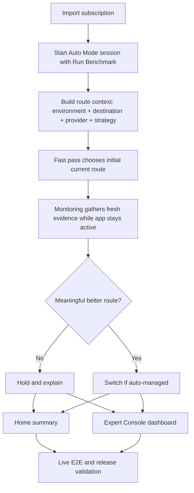

# feat: Plan network optimization roadmap

## Overview

This roadmap turns the new canonical product direction into a multi-sprint execution plan.

RockeRoom is no longer aiming to become only a benchmark client. The intended product is a network monitor and optimizer that helps the user find and maintain the best current `provider + strategy` for a destination in the current environment, with:

- `Auto Mode` as the one-button optimize and monitor path
- `Expert Console` as the dense power-user dashboard
- one shared routing-truth spine across monitoring, switching, explanation, and validation

The end-state this roadmap is driving toward should be read very specifically:

- for a given `environment`
- for a given `app` or curated destination category
- across candidate `node/provider` choices
- across candidate `routing strategy` choices

RockeRoom should be able to find the best current route and either apply it automatically or explain why it is holding.

In shorthand, the roadmap target is:

`best_route = f(environment, app_or_destination, node_or_provider, routing_strategy)`

The roadmap starts from the repo's current state, not from zero. Some adaptive-routing groundwork already exists, but the product is still missing the full route-context model, environment-aware decisions, strategy-explicit comparisons, stable monitoring behavior, and a dashboard worthy of the category.

## Problem Frame

The canonical direction in `docs/brainstorms/2026-04-05-network-optimization-product-direction-requirements.md` made the product goal much clearer:

- optimize by route context, not one global winner
- treat environment, destination, provider, and strategy as first-class dimensions
- make `Auto Mode` feel like a real optimizer
- make `Expert Console` explain and control the system without becoming a second truth model

The concrete product test at the end of the roadmap is not "does RockeRoom show a nice benchmark card?" It is:

- given an environment such as home Wi‑Fi or 5G
- given an app or destination such as OpenAI or YouTube
- given multiple node/provider candidates
- given multiple routing strategies

can RockeRoom determine the best current route, monitor it, and switch or hold for defensible reasons?

The current codebase only partially satisfies that direction.

What already exists:

- import-first app flow
- explicit `Run Benchmark` trigger
- destination-aware assignment model
- a first adaptive-routing session path after benchmark
- summary and expert surfaces split between `Home` and `Expert Console`

What is still missing:

- an explicit production model for environment context
- a stable route-candidate model that compares `provider + strategy` combinations cleanly
- monitoring and switching behavior that adapts to context changes instead of assuming one static routing world
- a power-user dashboard that shows route context, current route, better route, and switch or hold reasons at the right level of density
- an end-to-end validation story that proves not just benchmark completion, but monitoring, reassessment, switching, holds, and later environment-sensitive reassignment

If the work continues without a new roadmap, implementation will likely fragment across individual fixes and tactical plans. That would recreate the same problem the docs pass just resolved: many partially-correct pieces, no durable product sequence.

## Requirements Trace

- R1. Deliver RockeRoom as a network monitor and optimization app, not only a benchmark surface.
- R2. Make route context first-class across the product and runtime model: environment, destination, provider, and strategy.
- R2a. The terminal roadmap outcome must be explicit: for a specific `(environment, app/destination, node/provider, routing strategy)` tuple, RockeRoom can identify the best current route.
- R3. Make `Auto Mode` a one-button flow that can evaluate, monitor, and switch while the app remains active.
- R4. Make `Expert Console` the authoritative power-user dashboard for route evidence, alternatives, and controls.
- R5. Preserve a single shared truth spine across `Home`, `Expert Console`, automation, and tests.
- R6. Keep product language and runtime behavior aligned with the observability constraint: curated rule-backed destinations, not private per-app inspection.
- R7. Preserve foreground-only monitoring honesty and avoid promising always-on background optimization.
- R8. Produce a roadmap that sequences the work into reviewable, shippable sprints instead of one oversized feature branch.

## Scope Boundaries

- No rewrite of the import-first app shell or three-tab top-level navigation.
- No promise of universal support for arbitrary external templates or rule catalogs.
- No true background optimizer while the app is inactive.
- No move of dense manual controls onto `Home`.
- No requirement that Marketplace become a first-class pillar in this roadmap unless it can be powered by the same shared routing truth later.

## Context & Research

### Relevant Code and Patterns

- `App/AutoMode/AutoModeViewModel.swift` is still the orchestration center for import, benchmark, monitoring, restore, and summary-state behavior. Future sprints should continue extending this seam rather than inventing parallel controllers.
- `Shared/Domain/RoutingDestination.swift`, `Shared/Engine/DestinationRoutingAssignmentStore.swift`, and `Shared/Engine/DestinationFastPassRunner.swift` already define the early destination-aware routing vocabulary and should be evolved rather than bypassed.
- `App/Home/HomeView.swift` and `App/ExpertConsole/ExpertConsoleView.swift` already reflect the intended summary-vs-dashboard split. The roadmap should preserve that structure and enrich it instead of collapsing the two surfaces together.
- `docs/testing/live-e2e-workflow.md`, `App/Automation/LiveE2ERunner.swift`, and `UITests/LiveE2EWorkflowTests.swift` remain the canonical E2E contract surface and should be extended for each sprint rather than replaced.
- `README.md` and `docs/release/alpha-testflight-checklist.md` now describe the monitor-and-optimize direction and should stay synchronized with sprint outcomes.

### Institutional Learnings

- RockeRoom improves when one shared truth model feeds every surface. Every sprint should extend that invariant rather than add screen-local logic.
- Runtime seams selected too early become hard to test and hard to explain. The route-context model should therefore live in explicit app-session state and shared engine models, not hidden startup-only switches.
- The category research already showed that the product is fundamentally about route policy over changing conditions. Roadmap work should therefore prioritize context awareness, switching logic, and explanation over raw configuration breadth.

### External References

- `docs/research/2026-04-05-proxy-routing-ecosystem-intro.md` provides the relevant ecosystem grounding. No additional external research is needed for this roadmap pass.

## Key Technical Decisions

- **Create a new roadmap instead of reusing the 2026-04-04 alpha roadmap:** the older roadmap is still useful history, but it is scoped to the alpha-foundation era and does not fully capture the monitor-and-optimize product direction.
- **Sequence around product capabilities, not code layers:** each sprint should land a user-meaningful capability boundary such as route-context modeling, environment-aware decisions, dashboard evidence, or validation hardening.
- **Keep one shared route-context spine:** environment, destination, provider, strategy, evidence, assignment, hold, and switch reasons should all be represented in shared models consumable by both `Home` and `Expert Console`.
- **Make the tuple goal explicit in every sprint:** each sprint should move RockeRoom closer to selecting the best route for `(environment, app/destination, node/provider, strategy)` instead of improving generic benchmark infrastructure in isolation.
- **Treat environment as a real product dimension, but phase it responsibly:** start with a model and visible UX language before chasing fragile automatic detection heuristics.
- **Use the adaptive-routing session as the current baseline, not the final architecture:** future sprints should evolve it into a richer route optimizer rather than replace it with a second flow.

## Open Questions

### Resolved During Planning

- **Should this roadmap update the old `docs/plans/2026-04-04-003-feat-ios-next-sprints-roadmap-plan.md` in place?** No. Create a new roadmap because the canonical product direction changed materially and the older roadmap is now historical context.
- **What should be the primary origin document?** `docs/brainstorms/2026-04-05-network-optimization-product-direction-requirements.md`.
- **Is external research required?** No. The new requirements doc plus the ecosystem intro note provide enough current grounding for roadmap sequencing.

### Deferred to Implementation

- **Exact environment identity model:** the roadmap fixes the need for environment-aware routing, but the exact production representation can be finalized during Sprint 1 execution.
- **Exact supported strategy taxonomy:** the roadmap assumes strategy is explicit, but the final production set can evolve during implementation.
- **Exact release boundaries between later sprints:** the roadmap defines capability slices; final cut lines can shift slightly if execution reveals stronger atomic landing points.

## High-Level Technical Design

> *This illustrates the intended approach and is directional guidance for review, not implementation specification. The implementing agent should treat it as context, not code to reproduce.*

## Phased Delivery

### Sprint 1
- Route-context foundations and shared model cleanup
- Implemented foundation vocabulary should stay stable unless later sprint work proves a real gap:
  `NetworkEnvironment`, `RoutingStrategy`, `RouteContext`, and `DestinationRoutingAssignment.routeContext`

### Sprint 2
- Candidate evaluation engine and environment-aware decision inputs

### Sprint 3
- Auto Mode monitoring, reassessment, and stable switching behavior

### Sprint 4
- Expert Console dashboard maturation and manual control semantics

### Sprint 5
- Home summary polish, route-history explanation, and full validation hardening

### Sprint 6
- Release-readiness, operational proof, and roadmap handoff for post-v1 expansion

By the end of Sprint 6, the product should be able to answer the core question in a specific form:

- for environment `E`
- for app or destination `A`
- among node/provider candidates `N1...Nn`
- among strategy candidates `S1...Sn`

which combination is best now, should RockeRoom switch to it, and how should that decision be explained to the user?

## Implementation Units

- [ ] **Unit 1: Sprint 1 - Route-context foundations**

**Goal:** Introduce a shared production model for route context so the app can reason about environment, destination, provider, and strategy together instead of treating destination assignment as the whole state.

**Requirements:** R1, R2, R5, R6

**Dependencies:** Current adaptive-routing baseline

**Files:**
- Modify: `Shared/Domain/RoutingDestination.swift`
- Create: `Shared/Domain/RouteContext.swift`
- Create: `Shared/Domain/NetworkEnvironment.swift`
- Create: `Shared/Domain/RoutingStrategy.swift`
- Modify: `Shared/Engine/DestinationRoutingAssignmentStore.swift`
- Modify: `Shared/Engine/DestinationFastPassRunner.swift`
- Modify: `App/AutoMode/AutoModeViewModel.swift`
- Test: `Tests/DestinationRoutingContractTests.swift`
- Test: `Tests/AutoModeViewModelTests.swift`
- Test: `Tests/TestSupport.swift`

**Approach:**
- Add one explicit route-context vocabulary that can travel through benchmark, monitoring, persistence, UI, and tests.
- Model environment as a first-class concept even if early values are simple or user-legible rather than fully auto-detected.
- Separate "current assignment" from "current context" so future monitoring can reassess when environment or strategy conditions shift.
- Evolve existing destination-assignment structures rather than replacing them wholesale.

**Execution note:** Implement test-first for the new route-context domain behavior because this unit changes the shared product vocabulary.

**Patterns to follow:**
- Follow the existing shared-domain style in `Shared/Domain/RoutingDestination.swift`.
- Follow the persistence and restoration patterns already used by `Shared/Engine/DestinationRoutingAssignmentStore.swift`.

**Test scenarios:**
- Happy path: a route context can represent environment, destination, provider, and strategy together and survive persistence round-trips.
- Happy path: restoring app state yields the same route-context fields that were previously saved.
- Edge case: missing environment data falls back to an explicit unknown or default environment instead of corrupting the assignment.
- Edge case: unsupported strategy labels degrade to a stable fallback representation.
- Error path: corrupted stored route-context payload falls back safely without wiping valid imported subscription state.
- Integration: `AutoModeViewModel.restoreState()` hydrates route context and current assignment together for `Home` and `Expert Console`.

**Verification:**
- The app has one shared route-context model that later sprints can extend without inventing parallel representations.
- Sprint 1 names the shared foundation explicitly: `NetworkEnvironment`, `RoutingStrategy`, and `RouteContext`.

- [ ] **Unit 2: Sprint 2 - Candidate evaluation and environment-aware route scoring**

**Goal:** Upgrade the optimizer from destination-only fast pass into a route evaluator that compares `provider + strategy` candidates within the current environment.

**Requirements:** R1, R2, R3, R5, R6

**Dependencies:** Unit 1

**Files:**
- Modify: `Shared/Engine/DestinationFastPassRunner.swift`
- Create: `Shared/Engine/RouteCandidateEvaluator.swift`
- Create: `Shared/Engine/EnvironmentContextResolver.swift`
- Modify: `Shared/Engine/ProbeRunner.swift`
- Modify: `Shared/Engine/ResultSnapshot.swift`
- Modify: `App/AutoMode/AutoModeViewModel.swift`
- Test: `Tests/RouteCandidateEvaluatorTests.swift`
- Test: `Tests/ProbeRunnerTests.swift`
- Test: `Tests/AutoModeViewModelTests.swift`

**Approach:**
- Replace implicit evaluation of "best destination assignment" with explicit evaluation of route candidates defined by provider, strategy, and current environment.
- Start with common-sense signals already acceptable in the product language: latency, failures, freshness, stability, and reachability.
- Keep environment resolution simple and honest at first; the roadmap only requires that the engine can accept environment as an input, not that Sprint 2 perfects automatic environment classification.
- Preserve the ability to explain candidate comparison in user-facing terms later.

**Execution note:** Start with failing policy and evaluator tests for candidate comparison before modifying the benchmark runner.

**Patterns to follow:**
- Follow the centralized policy pattern already used by `Shared/Engine/RecommendationPolicy.swift`.
- Reuse the evidence vocabulary already shared between `ProbeRunner`, `ResultSnapshot`, and the adaptive-routing code.

**Test scenarios:**
- Happy path: two candidates for the same destination in the same environment produce a stable winner based on route-health signals.
- Happy path: the same destination can choose a different best candidate under a different environment input.
- Edge case: weak evidence produces a hold or low-confidence outcome instead of a forced winner.
- Edge case: unavailable strategy candidates are excluded without breaking other candidate evaluation.
- Error path: no valid candidates for a destination produces a degraded result that remains explainable.
- Integration: `Run Benchmark` produces route-context-aware assignments rather than destination-only recommendations.

**Verification:**
- The optimizer can compare route candidates in a way that is compatible with the product's route-context model.

- [ ] **Unit 3: Sprint 3 - Auto Mode monitoring and stable switching**

**Goal:** Make `Auto Mode` behave like a real optimizer that can monitor, reassess, and switch while the app stays active, without route churn or hidden behavior.

**Requirements:** R3, R5, R7

**Dependencies:** Unit 2

**Files:**
- Modify: `App/AutoMode/AutoModeViewModel.swift`
- Create: `Shared/Engine/AdaptiveMonitoringCoordinator.swift`
- Create: `Shared/Engine/RouteSwitchPolicy.swift`
- Modify: `App/RockeRoomApp.swift`
- Modify: `Shared/Engine/DestinationRoutingAssignmentStore.swift`
- Test: `Tests/AutoModeViewModelTests.swift`
- Test: `Tests/RouteSwitchPolicyTests.swift`
- Test: `Tests/AppSessionRestoreTests.swift`
- Test: `Tests/LiveE2EScenarioTests.swift`

**Approach:**
- Move from "monitoring exists" to "monitoring is stable, explainable, and bounded by foreground lifecycle".
- Add explicit hold reasons for weak gains, stale evidence, active pinning, and safety throttles.
- Ensure reassessment is capable of responding to changed context rather than only rerunning the same static benchmark assumptions.
- Persist recent switch or hold state so `Home` and `Expert Console` can explain current behavior after restore.

**Execution note:** Start with failing integration tests for monitoring lifecycle and switch or hold behavior before widening the runtime loop.

**Patterns to follow:**
- Follow the existing lifecycle wiring pattern in `App/RockeRoomApp.swift`.
- Mirror the explicit hold reasoning style already used by `Shared/Engine/RecommendationPolicy.swift`.

**Test scenarios:**
- Happy path: after `Run Benchmark`, monitoring continues while the app is active and can auto-switch when a better route is found.
- Happy path: recent switch state is visible after relaunch or foreground restore.
- Edge case: a small gain stays on the current route and records an explicit hold reason.
- Edge case: a pinned destination never auto-switches even when a better route exists.
- Error path: monitoring failure preserves the last known route and surfaces degraded monitoring state rather than resetting the session.
- Integration: app active/inactive transitions start and stop monitoring consistently without claiming background optimization.

**Verification:**
- `Auto Mode` behaves like a bounded, foreground optimizer rather than a one-shot measurement screen.

- [ ] **Unit 4: Sprint 4 - Expert Console dashboard and manual control model**

**Goal:** Turn `Expert Console` into the power-user dashboard that explains route context, current route, alternatives, and control state without creating a second engine.

**Requirements:** R4, R5, R6

**Dependencies:** Unit 3

**Files:**
- Modify: `App/ExpertConsole/ExpertConsoleViewModel.swift`
- Modify: `App/ExpertConsole/ExpertConsoleView.swift`
- Modify: `App/AppRootView.swift`
- Create: `App/ExpertConsole/RouteContextInspectorView.swift`
- Create: `App/ExpertConsole/RouteChangeHistoryView.swift`
- Test: `Tests/ExpertConsoleViewModelTests.swift`
- Test: `UITests/LiveE2EWorkflowTests.swift`

**Approach:**
- Expose route context as the primary console vocabulary: environment, destination, provider, strategy, current health, better alternative, and current control mode.
- Add visible switch and hold reasoning plus lightweight history so users can understand why RockeRoom acted or stayed put.
- Keep manual controls scoped to the same shared truth layer used by `Auto Mode`.
- Avoid trying to mirror raw config syntax or giant rule sets; the dashboard should stay evidence-first and product-legible.

**Patterns to follow:**
- Follow the existing split where `AppRootView` coordinates shared state between `Home` and `Expert Console`.
- Reuse the existing list-and-section presentation pattern in `App/ExpertConsole/ExpertConsoleView.swift`.

**Test scenarios:**
- Happy path: `Expert Console` renders current route context and current control mode for supported destinations.
- Happy path: a better alternative is visible with a human-legible reason for recommendation or switch.
- Edge case: stale or partial evidence is shown as uncertain rather than presented as fully current.
- Edge case: manual pin or override state is visible and prevents conflicting auto-control language.
- Error path: missing recent-change history degrades gracefully without breaking the console.
- Integration: `Home` and `Expert Console` show the same current route and same control state after a monitoring-driven switch.

**Verification:**
- Power users can inspect and understand the optimizer's decisions without reading raw engine configuration.

- [ ] **Unit 5: Sprint 5 - Home summary, route history, and validation hardening**

**Goal:** Make the top-level product loop feel coherent and trustworthy by strengthening `Home` messaging, route-history summaries, and the simulator-backed validation contract.

**Requirements:** R1, R3, R5, R7, R8

**Dependencies:** Unit 4

**Files:**
- Modify: `App/Home/HomeView.swift`
- Modify: `App/AutoMode/AutoModeViewModel.swift`
- Modify: `docs/testing/live-e2e-workflow.md`
- Modify: `docs/release/alpha-testflight-checklist.md`
- Modify: `README.md`
- Test: `UITests/LiveE2EWorkflowTests.swift`
- Test: `Tests/LiveE2EScenarioTests.swift`

**Approach:**
- Tighten the `Home` summary so it answers three questions clearly:
  - is monitoring active
  - is the current route good enough
  - what changed recently
- Extend the E2E scenario matrix to prove monitoring, switching, hold reasons, and later environment-sensitive reassessment contracts.
- Keep the docs and release checklist synchronized with the actual product loop under test.
- Use visible UI-state validation rather than relying only on unit-level logic assertions.

**Patterns to follow:**
- Follow the summary-first information hierarchy already present in `App/Home/HomeView.swift`.
- Reuse the launch-driven scenario contract already established in `docs/testing/live-e2e-workflow.md`.

**Test scenarios:**
- Happy path: `Home` shows active monitoring, current route health, and recent route change summary after a benchmark session.
- Happy path: deterministic E2E scenarios prove auto-switch and hold behavior visibly in the UI.
- Edge case: stale evidence state is clear on `Home` and consistent with `Expert Console`.
- Edge case: no recent route change degrades to a calm steady-state summary.
- Error path: failed reassignment shows recoverable status without hiding the last known route context.
- Integration: docs, launch scenarios, and UI restore behavior all describe the same monitor-and-optimize loop.

**Verification:**
- The top-level app loop feels like a coherent monitor and optimizer, and the validation contract proves that behavior end to end.

- [ ] **Unit 6: Sprint 6 - Release hardening and post-v1 expansion seam**

**Goal:** Harden the product for release-quality validation and leave a clean seam for later expansion such as richer environment inference or Marketplace evidence built from the same truth spine.

**Requirements:** R1, R5, R7, R8

**Dependencies:** Unit 5

**Files:**
- Modify: `docs/release/alpha-testflight-checklist.md`
- Modify: `README.md`
- Modify: `docs/plans/2026-04-05-004-feat-adaptive-routing-after-benchmark-plan.md`
- Modify: `docs/brainstorms/2026-04-05-network-optimization-product-direction-requirements.md`
- Test: `UITests/LiveE2EWorkflowTests.swift`
- Test: `Tests/AutoModeViewModelTests.swift`

**Approach:**
- Review the completed roadmap outcomes against the canonical product-direction doc and tighten any remaining mismatch.
- Lock in the release-validation story for the monitor-and-optimize loop.
- Document the explicit seam for later work that is out of current scope, such as richer environment inference, broader strategy support, or Marketplace evidence expansion.
- Avoid expanding scope inside the hardening sprint; this sprint is for proof, cleanup, and handoff.

**Patterns to follow:**
- Follow the repo's existing practice of using docs and validation artifacts as durable product contracts.
- Reuse the release-checklist proof-point structure already established in `docs/release/alpha-testflight-checklist.md`.

**Test scenarios:**
- Happy path: the full route-optimization loop passes deterministic validation from import through monitoring and expert inspection.
- Happy path: release docs and current product behavior describe the same user journey.
- Edge case: deferred future capabilities are documented clearly without being implied as shipped behavior.
- Error path: a known degraded route state remains supportable and documented rather than hidden.
- Integration: the final roadmap handoff leaves one coherent source of truth for product direction, validation, and implementation status.

**Verification:**
- RockeRoom has a release-quality roadmap completion point and a clean boundary for the next roadmap after v1.

## Success Metrics

- A reviewer can state the roadmap end-state in tuple form: `best_route = f(environment, app_or_destination, node_or_provider, routing_strategy)`.
- `Auto Mode` can evaluate and maintain the best current route for that tuple while the app stays active.
- `Expert Console` can display the tuple inputs, current best route, competing candidates, and switch or hold reasons.
- The E2E validation contract proves more than benchmark completion; it proves route selection, monitoring, switching, and explanation against the tuple model.

## System-Wide Impact

- **Interaction graph:** This roadmap affects shared domain models, optimization engines, app lifecycle coordination, both primary UI surfaces, E2E automation, and release documentation.
- **Error propagation:** Monitoring and switching failures must remain explainable all the way from shared engine policy to `Home`, `Expert Console`, and E2E evidence.
- **State lifecycle risks:** Route context, current assignment, recent switch state, stale evidence, and pin state must restore coherently across launches and foreground transitions.
- **API surface parity:** `Home`, `Expert Console`, docs, and test harnesses must all use the same route-context vocabulary.
- **Integration coverage:** Each sprint requires both shared-engine tests and cross-layer simulator-backed validation so the roadmap does not drift into unproven logic.
- **Unchanged invariants:** import-first shell, summary-first `Home`, foreground-only monitoring honesty, curated rule-backed destinations, and one shared truth spine remain fixed.

## Risks & Dependencies

| Risk | Mitigation |
|------|------------|
| Environment becomes a vague doc-only concept and never reaches product reality | Make Sprint 1 introduce a real shared environment model, even if initial values are simple |
| The optimizer grows more complex than the UI can explain | Sequence dashboard and summary work after route-context and policy work so explanation stays grounded in real engine outputs |
| Monitoring churn creates unstable switching behavior | Add explicit switch-policy and hold-reason tests in Sprint 3 before polishing UI |
| `Expert Console` turns into a second engine with its own logic | Keep all route-context, hold, and switch semantics in shared engine and view-model layers consumed by both surfaces |
| Validation lags behind implementation | Extend `docs/testing/live-e2e-workflow.md` and scenario-backed tests in every sprint instead of saving E2E work for the end |

## Documentation / Operational Notes

- Treat this roadmap as the current multi-sprint sequence for the monitor-and-optimize product direction.
- Keep `docs/brainstorms/2026-04-05-network-optimization-product-direction-requirements.md` as the authoritative product source and update roadmap status against it.
- The older alpha roadmap in `docs/plans/2026-04-04-003-feat-ios-next-sprints-roadmap-plan.md` should be treated as historical context, not the active roadmap.

## Sources & References

- **Origin document:** `docs/brainstorms/2026-04-05-network-optimization-product-direction-requirements.md`
- Related roadmap: `docs/plans/2026-04-04-003-feat-ios-next-sprints-roadmap-plan.md`
- Related implementation plan: `docs/plans/2026-04-05-004-feat-adaptive-routing-after-benchmark-plan.md`
- Related roadmap precursor: `docs/plans/2026-04-04-016-feat-routing-optimization-core-plan.md`
- Validation contract: `docs/testing/live-e2e-workflow.md`
- Ecosystem background: `docs/research/2026-04-05-proxy-routing-ecosystem-intro.md`
