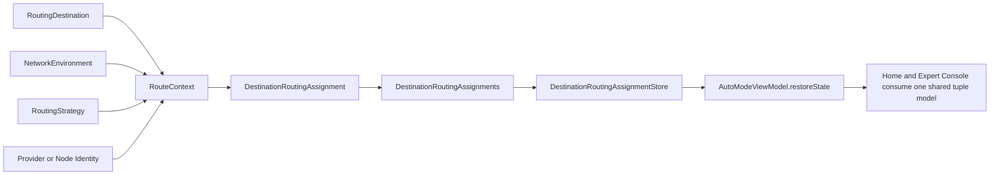

# feat: Plan route-context foundations

## Overview

This plan defines Sprint 1 of the network-optimization roadmap: introduce route-context foundations so RockeRoom can reason about route choice as a tuple instead of treating destination assignment as the whole product state.

The end-state for this sprint is not full environment-aware optimization yet. The end-state is a stable shared vocabulary and persistence shape for:

- environment
- app or curated destination
- provider or node
- routing strategy

That gives later sprints one production model to extend toward the roadmap target:

`best_route = f(environment, app_or_destination, node_or_provider, routing_strategy)`

## Problem Frame

The current adaptive-routing baseline already persists destination assignments and exposes current provider and strategy labels, but it still treats those assignments as mostly destination-scoped records. That is too narrow for the product direction now fixed in `docs/brainstorms/2026-04-05-network-optimization-product-direction-requirements.md`.

The product has to reach a more specific question:

- in environment `E`
- for destination `A`
- with provider or node candidates `N`
- across routing strategies `S`

what is the best current route?

The current shared model cannot answer that cleanly because:

- environment is not represented as first-class state
- strategy is still mostly a label attached to assignments, not a durable shared vocabulary
- destination assignment and route context are conflated
- restore paths and tests do not yet assert on the full tuple shape

If Sprint 1 does not establish that shared tuple vocabulary now, later scoring, monitoring, switching, and dashboard work will either:

- invent parallel route-context models in different layers, or
- keep retrofitting destination-only types until the product model becomes muddy

This sprint fixes that early.

## Requirements Trace

- R1. Introduce a shared production route-context model that represents environment, destination, provider, and strategy together.
- R2. Preserve the current observability honesty: destination labels remain curated rule-backed categories, not private per-app inspection.
- R3. Make environment first-class in the product model even if early values are simple, explicit, or partially user-legible.
- R4. Separate current assignment from current route context so later monitoring can react to context changes without overloading one struct.
- R5. Keep one shared truth spine across persistence, restore, benchmark state, `Home`, `Expert Console`, and tests.
- R6. Evolve the current adaptive-routing baseline rather than replacing it with a second route model.
- R7. Add test coverage that locks the new tuple vocabulary before later sprints build scoring and switching logic on top of it.

## Scope Boundaries

- No environment-aware scoring engine in this sprint.
- No automatic environment detection heuristics beyond the minimum needed to define the model shape.
- No new dashboard UI or major `Home` redesign.
- No switch-threshold or monitoring-policy changes beyond what is required to thread the new model through shared state.
- No broad Marketplace expansion.

## Context & Research

### Relevant Code and Patterns

- `Shared/Domain/RoutingDestination.swift` already defines the curated destination catalog, routing mode, assignment source, assignment status, and destination-assignment container. This is the natural place to either evolve or split route-context vocabulary from assignment vocabulary.
- `Shared/Engine/DestinationRoutingAssignmentStore.swift` already persists codable route state through the same actor-backed pattern used elsewhere in the repo. Sprint 1 should preserve that persistence style rather than inventing a new storage seam.
- `App/AutoMode/AutoModeViewModel.swift` already restores destination assignment state and adaptive-routing session state. It is the key integration seam for proving the new tuple model survives restore without adding another coordinator.
- `Tests/DestinationRoutingAssignmentTests.swift`, `Tests/DestinationRoutingAssignmentStoreTests.swift`, and `Tests/DestinationRoutingContractTests.swift` already act as characterization coverage for the current destination-routing vocabulary and should be extended rather than bypassed.
- `Tests/AutoModeViewModelTests.swift` and `Tests/TestSupport.swift` already contain helper patterns for persisted state, restore behavior, and adaptive-routing evaluator stubs.

### Institutional Learnings

- Shared vocabulary changes are high-leverage and high-risk in this repo. When the model is vague, later UI and runtime work diverge quickly.
- The repo is already trending toward actor-backed stores plus codable shared-domain payloads. Sprint 1 should stay inside that pattern.
- The docs pass already made the tuple goal explicit. This sprint should turn that doc truth into production model truth before later scoring work lands.

### External References

- `docs/research/2026-04-05-proxy-routing-ecosystem-intro.md` clarifies that the real optimization unit is a tuple of environment, destination, provider or node, and routing strategy.

## Key Technical Decisions

- **Split route context from route assignment conceptually:** assignment answers "what is currently chosen," while route context answers "under what tuple is this route being chosen." The code can co-locate them, but the plan should keep the concepts distinct.
- **Model environment explicitly in shared domain now:** even if initial values are limited to `.unknown`, `.wifiHome`, `.wifiOther`, or `.cellular`, the type must exist before later sprints can reason on it.
- **Promote strategy from ad hoc string to shared vocabulary:** keep a stable shared domain representation for strategies while still allowing raw configuration labels to be preserved when needed.
- **Prefer additive evolution of current types:** extend `RoutingDestination`-adjacent vocabulary and `DestinationRoutingAssignments` persistence instead of replacing the whole adaptive-routing baseline.
- **Use tests as the contract for the tuple model:** this sprint changes foundational product language, so test-first is the right posture.

## Open Questions

### Resolved During Planning

- **Should Sprint 1 create a brand-new store separate from `DestinationRoutingAssignmentStore`?** No. Evolve the current store and payload shape unless execution proves the current container is fundamentally incapable of expressing route context.
- **Should environment be deferred until a later sprint because detection is not finalized?** No. The model must exist now even if early values are simple or partially manual.
- **Should strategy remain just a string on assignments?** No. Keep a shared strategy vocabulary so later candidate evaluation does not build on opaque labels alone.

### Deferred to Implementation

- **Exact `NetworkEnvironment` cases:** the plan requires a first-class type, but the exact initial enum surface can be finalized while reading current app and OS seams.
- **Whether `RouteContext` nests destination assignment or references it externally:** the sprint must separate the concepts, but the exact struct composition can be finalized during implementation.
- **Backward-compatibility shape for persisted assignment payloads:** implementation can choose whether to add tolerant decoding, default values, or a lightweight migration path once the final codable shapes are known.

## High-Level Technical Design

> *This illustrates the intended approach and is directional guidance for review, not implementation specification. The implementing agent should treat it as context, not code to reproduce.*

## Implementation Units

- [x] **Unit 1: Define shared route-context vocabulary**

**Goal:** Add shared domain types for route context, network environment, and routing strategy, and make the separation between route context and route assignment explicit.

**Requirements:** R1, R2, R3, R4, R6, R7

**Dependencies:** Current adaptive-routing baseline only

**Files:**
- Modify: `Shared/Domain/RoutingDestination.swift`
- Create: `Shared/Domain/RouteContext.swift`
- Create: `Shared/Domain/NetworkEnvironment.swift`
- Create: `Shared/Domain/RoutingStrategy.swift`
- Test: `Tests/DestinationRoutingAssignmentTests.swift`
- Test: `Tests/DestinationRoutingContractTests.swift`

**Approach:**
- Introduce shared types that can represent:
  - environment identity
  - destination identity
  - provider or node identity
  - routing strategy identity
- Keep `RoutingDestination` focused on curated destination identity and avoid overloading it with environment or provider state.
- Clarify whether `DestinationRoutingAssignment` stores a `RouteContext`, a subset of it, or enough fields to derive one consistently.
- Preserve codable and sendable semantics because these types must travel through persistence and actor-backed stores.

**Execution note:** Implement new shared-domain behavior test-first because this unit changes the repo's core routing vocabulary.

**Patterns to follow:**
- Follow the shared-domain style already used in `Shared/Domain/RoutingDestination.swift`.
- Follow the characterization-test style already used in `Tests/DestinationRoutingAssignmentTests.swift`.

**Test scenarios:**
- Happy path: a route context can represent environment, destination, provider, and strategy together.
- Happy path: a routing strategy round-trips through codable representation without losing stable identity.
- Edge case: missing environment data resolves to an explicit unknown or default environment rather than nil-driven ambiguity.
- Edge case: unsupported raw strategy labels degrade to a stable fallback representation that can still be persisted.
- Error path: malformed route-context payloads fail or degrade predictably rather than silently constructing invalid state.
- Integration: the shared contract tests can express the tuple model without introducing a second test-only vocabulary.

**Verification:**
- The repo has one production tuple vocabulary that later sprints can reuse for scoring, monitoring, and UI explanation.

- [x] **Unit 2: Evolve persisted routing state to carry route context**

**Goal:** Update destination-routing persistence so the current shared store can save and restore route-context-aware assignments safely.

**Requirements:** R1, R4, R5, R6, R7

**Dependencies:** Unit 1

**Files:**
- Modify: `Shared/Engine/DestinationRoutingAssignmentStore.swift`
- Modify: `Shared/Domain/RoutingDestination.swift`
- Test: `Tests/DestinationRoutingAssignmentStoreTests.swift`
- Test: `Tests/DestinationRoutingAssignmentTests.swift`

**Approach:**
- Extend the existing codable payload shape to carry route-context fields or a nested route-context object.
- Keep the current actor-backed store and corruption-clearing behavior intact.
- Make restore behavior tolerant enough that current persisted payloads do not become undefined behavior during rollout.
- Preserve selected-destination semantics while making room for richer route-context state per assignment.

**Patterns to follow:**
- Follow the actor-backed persistence pattern already present in `Shared/Engine/DestinationRoutingAssignmentStore.swift`.
- Follow the corruption-clearing store tests already used in `Tests/DestinationRoutingAssignmentStoreTests.swift`.

**Test scenarios:**
- Happy path: a route-context-aware assignment round-trips through the store with environment and strategy intact.
- Happy path: multiple assignments with different environments or strategies persist without losing selected-destination state.
- Edge case: old payloads that lack new route-context fields restore with safe default values.
- Edge case: one malformed assignment does not silently corrupt unrelated valid store behavior if the chosen decode strategy supports tolerant fallback.
- Error path: fully corrupted payload still clears and returns nil, preserving existing store invariants.
- Integration: the persisted container remains usable by the existing adaptive-routing baseline after the new fields are introduced.

**Verification:**
- Route-context-aware assignment state can be saved and restored through the existing shared store with no new persistence seam.

- [x] **Unit 3: Thread route context through restore and adaptive-routing orchestration**

**Goal:** Make `AutoModeViewModel` restore and expose route-context-aware state so later sprints can build on one runtime seam.

**Requirements:** R3, R4, R5, R6, R7

**Dependencies:** Unit 2

**Files:**
- Modify: `App/AutoMode/AutoModeViewModel.swift`
- Modify: `Shared/Engine/DestinationFastPassRunner.swift`
- Test: `Tests/AutoModeViewModelTests.swift`
- Test: `Tests/TestSupport.swift`

**Approach:**
- Update restore logic so route context is hydrated alongside current assignment state.
- Ensure the current fast-pass evaluator and assignment updates can produce the richer shape even if environment values remain simple in Sprint 1.
- Avoid adding new UI logic here; this unit is about runtime truth plumbing, not presentation redesign.
- Extend test helpers so later sprints can seed route-context-aware assignments without duplicating fixture logic.

**Execution note:** Start with failing restore-path tests before modifying `AutoModeViewModel` integration.

**Patterns to follow:**
- Follow the current restore and state-application pattern already used in `App/AutoMode/AutoModeViewModel.swift`.
- Follow the test-helper style already used in `Tests/TestSupport.swift`.

**Test scenarios:**
- Happy path: `restoreState()` hydrates route context and current assignment together from persisted state.
- Happy path: a fresh fast-pass evaluation can emit assignments with route-context fields populated.
- Edge case: persisted assignments without explicit environment still restore to a safe default environment.
- Edge case: debug reset clears route-context-aware assignment state together with the rest of adaptive-routing state.
- Error path: degraded adaptive-routing state does not lose previously restored route-context fields unless storage is explicitly cleared.
- Integration: one test can seed route-context-aware assignments and verify `AutoModeViewModel` exposes them consistently after restore.

**Verification:**
- The runtime seam used by benchmark and restore now understands the tuple model instead of only destination-scoped assignment records.

- [x] **Unit 4: Lock the Sprint 1 contract in tests and validation docs**

**Goal:** Make the new tuple vocabulary visible in the shared test contract and validation docs so later sprints cannot drift back to destination-only thinking.

**Requirements:** R2, R3, R5, R7

**Dependencies:** Unit 3

**Files:**
- Modify: `Tests/DestinationRoutingContractTests.swift`
- Modify: `docs/testing/live-e2e-workflow.md`
- Modify: `docs/plans/2026-04-05-006-feat-network-optimization-roadmap-plan.md`

**Approach:**
- Extend the contract tests so they assert the tuple model explicitly, not just provider truth and hold behavior.
- Update the live E2E workflow doc to reflect that Sprint 1 introduced the route-context model even if environment-aware reassessment is still future work.
- Keep the roadmap synchronized with any Sprint 1 implementation clarifications discovered during planning.

**Patterns to follow:**
- Follow the current contract-test style already present in `Tests/DestinationRoutingContractTests.swift`.
- Reuse the scenario-contract language already present in `docs/testing/live-e2e-workflow.md`.

**Test scenarios:**
- Test expectation: none -- this unit is primarily contract-test and doc alignment work. Review should confirm the docs and contract tests describe the same tuple vocabulary introduced by Sprint 1.

**Verification:**
- Later sprint plans and implementations inherit one explicit tuple contract instead of sliding back into destination-only wording.

## System-Wide Impact

- **Interaction graph:** This sprint touches shared domain models, shared persistence, adaptive-routing orchestration, restore behavior, shared tests, and validation docs.
- **Error propagation:** If route-context decoding or defaulting is wrong, restore behavior will surface ambiguous assignment state in both `Home` and `Expert Console`.
- **State lifecycle risks:** Persisted assignment payloads may already exist, so backward-tolerant decoding or explicit defaulting needs to be designed intentionally.
- **API surface parity:** `AutoModeViewModel`, the assignment store, contract tests, and docs must all use the same tuple vocabulary.
- **Integration coverage:** Store round-trip and restore-path tests are necessary because pure model tests will not prove that actor-backed persistence and runtime hydration still align.
- **Unchanged invariants:** import-first shell, summary-first `Home`, foreground-only monitoring honesty, curated rule-backed destinations, and one shared truth spine remain fixed.

## Risks & Dependencies

| Risk | Mitigation |
|------|------------|
| The sprint introduces route-context types but leaves assignment and restore behavior effectively destination-only | Require store and `AutoModeViewModel` integration in the same sprint |
| Persisted payload evolution breaks restore for existing assignment data | Add explicit backward-compatibility or safe-default tests before changing store decoding |
| Strategy becomes a second opaque string vocabulary instead of a stable shared concept | Introduce `RoutingStrategy` as a domain type and test its stable identity behavior |
| Environment stays too vague to be useful later | Require at least a first-class type plus explicit unknown/default semantics in Sprint 1 |

## Documentation / Operational Notes

- Treat this sprint as the model-contract sprint for the roadmap. Later sprints should build on these types rather than redefining them.
- Keep `docs/research/2026-04-05-proxy-routing-ecosystem-intro.md` and `docs/plans/2026-04-05-006-feat-network-optimization-roadmap-plan.md` aligned with the implemented tuple vocabulary if execution reveals small naming adjustments.

## Sources & References

- **Origin document:** `docs/brainstorms/2026-04-05-network-optimization-product-direction-requirements.md`
- Related roadmap: `docs/plans/2026-04-05-006-feat-network-optimization-roadmap-plan.md`
- Related implementation baseline: `docs/plans/2026-04-05-004-feat-adaptive-routing-after-benchmark-plan.md`
- Ecosystem context: `docs/research/2026-04-05-proxy-routing-ecosystem-intro.md`
- Validation contract: `docs/testing/live-e2e-workflow.md`
