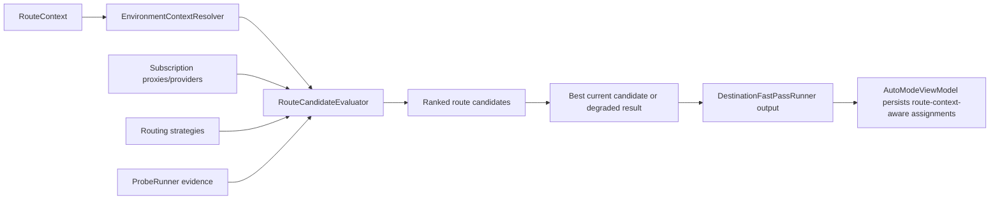

# feat: Plan route candidate evaluation

## Overview

This plan defines Sprint 2 of the network-optimization roadmap: upgrade RockeRoom from destination-only fast pass into explicit route-candidate evaluation.

Sprint 1 establishes the tuple vocabulary. Sprint 2 uses that vocabulary to compare candidates and answer a more specific product question:

- for environment `E`
- for destination `A`
- across node or provider candidates `N`
- across routing strategy candidates `S`

which route candidate is best right now?

The end-state for this sprint is not stable monitoring or a mature dashboard yet. The end-state is an evaluator that can accept route context as input, compare candidate combinations in a defensible way, and produce route-context-aware assignments that later sprints can monitor and explain.

## Problem Frame

The current adaptive-routing baseline already chooses destination assignments, but the evaluator is still too implicit.

Today:

- `DestinationFastPassRunner` manufactures per-destination health from proxy and destination fingerprints
- strategy is inferred by helper logic rather than represented as candidate space
- environment is not part of the evaluation input
- `ProbeRunner` and `ResultSnapshot` still think mostly in terms of provider candidates, not route candidates

That is not enough for the product direction now fixed in docs:

`best_route = f(environment, app_or_destination, node_or_provider, routing_strategy)`

Without Sprint 2, later monitoring and dashboard work would sit on top of a weak evaluator that still behaves like a smarter benchmark rather than a true route optimizer.

Sprint 2 therefore needs to make candidate evaluation explicit:

- what are the candidates
- which signals are compared
- how does environment influence the comparison
- how does the evaluator degrade when evidence is weak

This sprint should answer those questions without yet taking on full monitoring lifecycle or power-user dashboard scope.

## Requirements Trace

- R1. Represent route candidates explicitly as combinations of provider or node, routing strategy, destination, and current environment.
- R2. Evaluate candidates using common-sense route-health signals already acceptable in product language: latency, failures, freshness, stability, and reachability.
- R3. Allow the same destination to produce different best candidates under different environment inputs.
- R4. Keep evaluation honest when evidence is weak, partial, stale, or missing; do not force a fake winner.
- R5. Produce route-context-aware assignments from the benchmark path so later monitoring and UI work consume one evaluator output.
- R6. Preserve the current observability honesty: destination is still a curated rule-backed category, not private per-app inspection.
- R7. Keep candidate evaluation in shared engine code rather than letting `AutoModeViewModel` or future UI layers invent their own scoring logic.

## Scope Boundaries

- No stable monitoring loop redesign in this sprint.
- No new switch-throttle policy beyond the minimum needed to express “best candidate now.”
- No full `Expert Console` redesign or route-history UI.
- No attempt to perfect automatic environment detection heuristics.
- No raw config-template ingestion as the primary candidate-definition source.

## Context & Research

### Relevant Code and Patterns

- `Shared/Engine/DestinationFastPassRunner.swift` already plays the role of destination evaluator and is the natural seam to evolve toward explicit route-candidate evaluation.
- `Shared/Engine/ProbeRunner.swift` already owns concurrent candidate probing and early-stop logic. Sprint 2 should extend its evidence vocabulary rather than bypass it.
- `Shared/Engine/ResultSnapshot.swift` is still the shared evidence container. Candidate evaluation should either enrich or project from it rather than creating UI-local parallel evidence objects.
- `App/AutoMode/AutoModeViewModel.swift` already invokes the evaluator after benchmark and persists assignments. It is the correct orchestration seam for consuming the richer evaluator output.
- `Tests/ProbeRunnerTests.swift`, `Tests/RoutingOptimizationPolicyTests.swift`, and `Tests/AutoModeViewModelTests.swift` already cover adjacent behavior and should anchor the new tests.

### Institutional Learnings

- The repo benefits when scoring and hold logic stay centralized in shared engine code. Sprint 2 should follow the same pattern instead of embedding evaluator logic in the view model.
- The tuple goal is now explicit in docs. This sprint is where the evaluator must stop behaving like “destination plus provider guesswork” and start behaving like real route-candidate comparison.
- Environment should be introduced as a real evaluator input now, even if initial environment resolution remains simple or partially stubbed.

### External References

- `docs/research/2026-04-05-proxy-routing-ecosystem-intro.md` frames the optimization unit as tuple selection and supports explicit candidate comparison across environment, node/provider, and strategy.

## Key Technical Decisions

- **Create an explicit route-candidate evaluator:** do not hide candidate comparison inside `DestinationFastPassRunner` helper branches only. Introduce a named evaluator seam.
- **Make environment an input, not a post-hoc label:** Sprint 2 must allow the evaluator to accept environment and produce different outcomes for different environments.
- **Keep strategy first-class in candidate comparison:** strategy should be part of candidate identity, not only a derived output string.
- **Preserve one evidence spine:** evaluator outputs should remain compatible with `ProbeRunner`, `ResultSnapshot`, and assignment persistence rather than introducing screen-local score payloads.
- **Return honest degraded outcomes:** when evidence is weak or candidates are unavailable, the evaluator should emit an explainable degraded or hold-like result rather than manufacturing false certainty.

## Open Questions

### Resolved During Planning

- **Should Sprint 2 solve monitoring and switching too?** No. It should stop at route candidate evaluation and benchmark-path output. Monitoring and stable switching belong to Sprint 3.
- **Should environment resolution be perfect before evaluation starts using it?** No. The evaluator only needs a reliable input contract now; environment inference can improve later.
- **Should strategy remain evaluator-internal?** No. Candidate identity should expose strategy explicitly because the product asks users to reason about it later.

### Deferred to Implementation

- **Exact `RouteCandidate` shape:** implementation can decide whether candidate identity lives in `ResultSnapshot`, a sibling shared type, or both.
- **Exact environment resolver behavior:** implementation can start with a lightweight resolver as long as the evaluator accepts environment as an explicit input.
- **Exact mapping from probe metrics to route-health score:** the plan fixes the acceptable signal categories, but the specific weighting can be tuned during execution and tests.

## High-Level Technical Design

> *This illustrates the intended approach and is directional guidance for review, not implementation specification. The implementing agent should treat it as context, not code to reproduce.*

## Implementation Units

- [x] **Unit 1: Define route candidate and environment resolver seams**

**Goal:** Introduce shared engine seams for explicit route candidates and environment resolution so evaluation inputs are no longer implicit.

**Requirements:** R1, R3, R7

**Dependencies:** Sprint 1 route-context foundations

**Files:**
- Create: `Shared/Engine/RouteCandidateEvaluator.swift`
- Create: `Shared/Engine/EnvironmentContextResolver.swift`
- Modify: `Shared/Engine/DestinationFastPassRunner.swift`
- Test: `Tests/RouteCandidateEvaluatorTests.swift`

**Approach:**
- Define a route-candidate model that captures at least destination, environment, provider/node identity, and strategy.
- Introduce an environment resolver seam that can provide a current environment input without baking environment guessing directly into the evaluator.
- Keep the initial resolver simple and honest; the point of Sprint 2 is input structure, not sophisticated environment inference.
- Make `DestinationFastPassRunner` depend on the explicit evaluator rather than owning all comparison logic inline.

**Execution note:** Implement test-first because this unit changes the evaluator contract that later sprints will build on.

**Patterns to follow:**
- Follow the protocol-driven seam style already used by `Shared/Engine/ProbeRunner.swift`.
- Follow the existing adaptive-routing runner style in `Shared/Engine/DestinationFastPassRunner.swift`.

**Test scenarios:**
- Happy path: a route candidate can represent destination, environment, provider, and strategy together.
- Happy path: the environment resolver can provide an explicit environment input consumable by the evaluator.
- Edge case: missing or unknown environment still produces a valid candidate set with explicit unknown semantics.
- Edge case: unsupported strategy inputs are excluded or normalized predictably.
- Error path: no valid candidates yields a degraded evaluator result rather than a fabricated winner.
- Integration: `DestinationFastPassRunner` can delegate candidate comparison to the explicit evaluator seam.

**Verification:**
- Candidate identity and environment input are first-class evaluator concepts instead of inline hidden assumptions.

- [x] **Unit 2: Enrich probe and snapshot evidence for candidate comparison**

**Goal:** Ensure shared evidence types can support route-candidate evaluation without losing compatibility with the current benchmark pipeline.

**Requirements:** R2, R4, R5, R7

**Dependencies:** Unit 1

**Files:**
- Modify: `Shared/Engine/ProbeRunner.swift`
- Modify: `Shared/Engine/ResultSnapshot.swift`
- Test: `Tests/ProbeRunnerTests.swift`
- Test: `Tests/RouteCandidateEvaluatorTests.swift`

**Approach:**
- Review whether current `ProbeCandidateResult` and `ResultSnapshot` carry enough information for route-candidate comparison once strategy and environment become explicit.
- Add the minimum shared evidence needed to compare candidates across the accepted signal set: latency, failures, freshness, stability, and reachability.
- Preserve compatibility with existing benchmark consumers by evolving the shared evidence model additively.
- Keep the snapshot layer general-purpose enough that later monitoring and dashboard work can reuse it.

**Patterns to follow:**
- Follow the current codable shared-evidence style in `Shared/Engine/ResultSnapshot.swift`.
- Reuse the concurrent probing and early-stop behavior already present in `Shared/Engine/ProbeRunner.swift`.

**Test scenarios:**
- Happy path: probe results contain enough evidence to rank route candidates deterministically.
- Happy path: result snapshots preserve candidate evidence required for later assignment and explanation.
- Edge case: partial or incomplete probe evidence marks the result as partial instead of pretending full certainty.
- Edge case: different strategy candidates for the same provider remain distinguishable in the evidence layer.
- Error path: no probeable candidates produces a partial or degraded snapshot compatible with current restore semantics.
- Integration: the evaluator can consume snapshot evidence without requiring UI-local transformation logic.

**Verification:**
- Shared evidence types support route-candidate comparison without breaking the existing benchmark pipeline.

- [x] **Unit 3: Replace implicit fast-pass scoring with explicit candidate evaluation**

**Goal:** Make benchmark-path assignment selection come from explicit route-candidate evaluation rather than proxy fingerprint heuristics alone.

**Requirements:** R1, R2, R3, R4, R5, R7

**Dependencies:** Unit 2

**Files:**
- Modify: `Shared/Engine/DestinationFastPassRunner.swift`
- Modify: `App/AutoMode/AutoModeViewModel.swift`
- Test: `Tests/RouteCandidateEvaluatorTests.swift`
- Test: `Tests/AutoModeViewModelTests.swift`
- Test: `Tests/RoutingOptimizationPolicyTests.swift`

**Approach:**
- Refactor fast pass so it builds explicit route candidates, evaluates them, and emits assignments from the resulting ranking.
- Keep current hold or degraded behavior honest when the best candidate is weak, unavailable, or only marginally better.
- Ensure the evaluator can produce different winners for the same destination under different environments.
- Preserve the current benchmark entry flow in `AutoModeViewModel`; only the evaluator semantics should deepen here.

**Execution note:** Start with failing evaluator and view-model tests for environment-sensitive candidate outcomes before changing fast-pass runtime logic.

**Patterns to follow:**
- Follow the existing orchestration pattern in `App/AutoMode/AutoModeViewModel.swift`.
- Follow the centralized decision style already used by `Shared/Engine/RecommendationPolicy.swift` where possible.

**Test scenarios:**
- Happy path: benchmark produces a route-context-aware assignment chosen from explicit candidate evaluation.
- Happy path: the same destination can receive a different winning assignment under a different environment input.
- Edge case: a low-confidence winning candidate produces a degraded or hold-style result instead of forced selection language.
- Edge case: unavailable candidates for one destination do not corrupt assignment generation for other destinations.
- Error path: evaluator failure or empty candidate ranking leaves the benchmark path in an explainable degraded state.
- Integration: `AutoModeViewModel.optimize()` persists evaluator-driven assignments without bypassing the shared store.

**Verification:**
- The benchmark path now selects assignments through explicit route-candidate evaluation compatible with the tuple model.

- [x] **Unit 4: Lock Sprint 2 evaluator behavior in tests and contract docs**

**Goal:** Ensure later sprints inherit explicit candidate-evaluation semantics rather than slipping back to implicit destination-only scoring.

**Requirements:** R3, R4, R5, R7

**Dependencies:** Unit 3

**Files:**
- Modify: `Tests/RouteCandidateEvaluatorTests.swift`
- Modify: `Tests/AutoModeViewModelTests.swift`
- Modify: `docs/plans/2026-04-05-006-feat-network-optimization-roadmap-plan.md`
- Modify: `docs/testing/live-e2e-workflow.md`

**Approach:**
- Use tests to lock the idea that benchmark output now comes from explicit candidate comparison.
- Update the roadmap and validation doc only where Sprint 2 clarifies terminology or contract expectations around candidate evaluation.
- Keep docs honest about what Sprint 2 does not yet solve: stable monitoring, switching policy, and dashboard maturity.

**Patterns to follow:**
- Follow the current contract-tightening style already used in routing test files and plan docs.
- Reuse the simulator-backed scenario contract language in `docs/testing/live-e2e-workflow.md`.

**Test scenarios:**
- Test expectation: none -- this unit is mainly contract-test and doc alignment work. Review should confirm later sprints inherit explicit candidate-evaluation language and boundaries.

**Verification:**
- The repo's tests and docs now describe Sprint 2 as explicit route-candidate evaluation, not just smarter destination scoring.

## System-Wide Impact

- **Interaction graph:** This sprint touches shared engine evaluation seams, shared evidence types, benchmark orchestration, shared tests, and validation docs.
- **Error propagation:** Weak or missing evidence must flow into degraded evaluator outcomes rather than disappearing inside benchmark-path helper logic.
- **State lifecycle risks:** Candidate identity must stay stable enough that persisted assignment outputs remain meaningful to restore paths introduced in Sprint 1.
- **API surface parity:** evaluator outputs, route-context assignments, and benchmark orchestration must all describe candidates with the same tuple vocabulary.
- **Integration coverage:** unit tests alone are not enough; `AutoModeViewModel` tests must prove benchmark-path integration with the evaluator seam.
- **Unchanged invariants:** one shared truth spine, import-first shell, summary-first `Home`, foreground-only monitoring honesty, and no private per-app inspection claims remain fixed.

## Risks & Dependencies

| Risk | Mitigation |
|------|------------|
| Candidate evaluation stays implicit inside `DestinationFastPassRunner` despite the new plan | Require a named evaluator seam and tests that target it directly |
| Environment becomes a parameter that never actually changes outcomes | Add tests that prove the same destination can produce different winners under different environment inputs |
| Evidence types become overfit to Sprint 2 and hard to reuse later | Keep `ResultSnapshot` and probe results additive and general-purpose |
| Sprint 2 bleeds into monitoring or dashboard scope | Keep monitoring stability and power-user UI explicitly out of this sprint's requirements and units |

## Documentation / Operational Notes

- This sprint should leave the roadmap with a clear boundary: explicit candidate evaluation is in, but stable monitoring and switching policy are still next-sprint work.
- If execution reveals naming adjustments for route candidates or environment resolution, keep the roadmap and research intro aligned with the final tuple vocabulary.

## Sources & References

- **Origin document:** `docs/brainstorms/2026-04-05-network-optimization-product-direction-requirements.md`
- Related roadmap: `docs/plans/2026-04-05-006-feat-network-optimization-roadmap-plan.md`
- Related Sprint 1 plan: `docs/plans/2026-04-05-007-feat-route-context-foundations-plan.md`
- Related implementation baseline: `docs/plans/2026-04-05-004-feat-adaptive-routing-after-benchmark-plan.md`
- Ecosystem context: `docs/research/2026-04-05-proxy-routing-ecosystem-intro.md`
