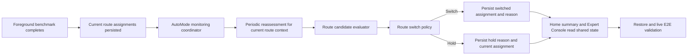

# feat: Plan Auto Mode monitoring and switching

## Overview

This plan defines Sprint 3 of the network-optimization roadmap: make `Auto Mode` behave like a real foreground optimizer after initial candidate evaluation.

Sprint 2 answers "which route candidate looks best right now?" Sprint 3 answers the harder follow-up:

- once a route is active
- while the app remains in the foreground
- for a specific `(environment, destination, provider, strategy)` tuple

when should RockeRoom keep the current route, when should it switch, and how should it explain that decision honestly?

The end-state for this sprint is not dashboard maturity yet. The end-state is stable monitoring behavior that can:

- reassess the active route on a clear cadence
- switch only when the gain is meaningful
- hold when evidence is weak, stale, pinned, or too close to call
- persist and restore enough state that monitoring does not feel random after relaunch

## Problem Frame

The current adaptive-routing baseline already starts a foreground monitoring loop after benchmark and can persist destination assignments. That is useful groundwork, but it is still too thin for the product direction.

Today:

- `AutoModeViewModel` owns the monitoring task directly
- monitoring reuses the same evaluator entry point, but there is no explicit monitoring or switch-policy seam
- hold behavior is partly implicit in `DestinationFastPassRunner`
- recent change summaries exist, but hold and switch reasons are not yet durable product-level decisions
- restore behavior can reload assignments, but not a richer monitoring-session truth about why the current route is being kept

That leaves the product vulnerable to the exact failure mode the new direction is trying to avoid: a benchmark that can pick a route once, but cannot defend ongoing optimizer behavior.

The product question for this sprint is more specific:

- for environment `E`
- for destination `A`
- with current route `(provider P1, strategy S1)`
- and a better-looking candidate `(provider P2, strategy S2)`

is the gain large and trustworthy enough to switch now, or should RockeRoom hold and explain why?

Without Sprint 3, the roadmap still misses the core Auto Mode promise from the canonical requirements document:

- evaluate
- monitor
- switch or hold
- explain the decision in common-sense route-health terms

## Requirements Trace

- R1. Turn `Auto Mode` into a real foreground optimization loop rather than a one-shot benchmark handoff.
- R2. Reassess route quality for the current `(environment, destination, provider, strategy)` tuple on a stable monitoring cadence while the app is active.
- R3. Make switch decisions explicit and policy-driven, not hidden inside evaluator helpers or view-model task code.
- R4. Represent hold reasons explicitly: pinned route, insignificant gain, weak confidence, stale evidence, no viable better candidate, or monitoring unavailable.
- R5. Preserve foreground-only honesty and stop active monitoring when the app becomes inactive or enters background.
- R6. Persist and restore enough monitoring state that the current route and recent hold or switch reasoning survive relaunch cleanly.
- R7. Keep one shared truth spine across engine policy, `AutoModeViewModel`, `Home`, `Expert Console`, and validation tests.
- R8. Keep product explanations in common-sense network terms such as latency, failures, freshness, stability, and route reachability.

## Scope Boundaries

- No `Expert Console` redesign in this sprint.
- No route-history timeline or dashboard analytics beyond the minimum current and recent decision state needed for Auto Mode.
- No true background optimizer while the app is inactive.
- No attempt to perfect environment detection; Sprint 3 consumes the current environment input contract.
- No major `Home` redesign beyond using richer monitoring state already exposed by the shared model.

## Context & Research

### Relevant Code and Patterns

- `App/AutoMode/AutoModeViewModel.swift` already owns optimize, restore, foreground lifecycle hooks, and the current monitoring task. Sprint 3 should deepen this seam instead of inventing a second controller.
- `Shared/Engine/DestinationFastPassRunner.swift` already contains implicit hold and switch threshold logic. That logic should be promoted into an explicit monitoring-policy seam rather than remain embedded in route-health helper flow.
- `Shared/Engine/DestinationRoutingAssignmentStore.swift` already persists route assignments through an actor-backed codable store. Sprint 3 should extend what is persisted only as far as needed for restore-safe monitoring behavior.
- `Shared/Domain/RoutingDestination.swift` already carries destination assignment status and recent change summary. Sprint 3 should evolve that shared model instead of creating UI-local switch or hold labels.
- `Tests/AutoModeViewModelTests.swift` already covers optimize and monitoring-loop basics, including a route switch during foreground monitoring.
- `Tests/AppSessionRestoreTests.swift`, `Tests/LiveE2EScenarioTests.swift`, and `docs/testing/live-e2e-workflow.md` are the right places to lock the restore and live-session contract.

### Institutional Learnings

- When routing decisions live partly in engine code and partly in view-model glue, the product becomes hard to explain and hard to test. Sprint 3 should centralize switch and hold decisions in shared engine policy.
- The roadmap now makes the tuple target explicit. Monitoring decisions therefore need to talk about "current route for this context" instead of "latest benchmark winner."
- Foreground-only honesty is a fixed product invariant. Monitoring state must make that constraint visible instead of silently pretending continuous optimization exists when the app is inactive.

### External References

- `docs/research/2026-04-05-proxy-routing-ecosystem-intro.md` supports the category expectation that the product should maintain the best current route under changing conditions, not just pick one once.

## Key Technical Decisions

- **Add an explicit switch-decision seam:** keep evaluator output and monitoring policy conceptually separate. Sprint 2 chooses the best candidate now; Sprint 3 decides whether that is enough to switch from the currently active route.
- **Model hold reasons as shared domain truth:** hold reasons must be explicit, persistable, and reusable by `Home`, `Expert Console`, and validation tests.
- **Keep monitoring coordinated from `AutoModeViewModel`, but move policy into shared engine code:** the view model should own lifecycle and task orchestration, not decide switch thresholds inline.
- **Persist recent routing decision state additively:** save enough current assignment and recent decision context to restore a believable session without introducing a heavyweight session-history subsystem too early.
- **Prefer stable switching over aggressive churn:** if evidence is weak, stale, or only slightly better, hold and explain rather than optimize for maximum volatility.
- **Treat foreground lifecycle as part of the product contract:** becoming active resumes reassessment; entering background stops it; restore should never imply continuous monitoring occurred while the app was away.

## Open Questions

### Resolved During Planning

- **Should Sprint 3 also redesign `Expert Console` to show all monitoring details?** No. The shared decision state should become available now, but dense dashboard presentation belongs to Sprint 4.
- **Should monitoring policy stay inside `DestinationFastPassRunner` because it already has threshold logic?** No. That logic should be explicit and testable as switch policy rather than hidden runner behavior.
- **Should this sprint promise always-on optimization after the user closes the app?** No. The sprint should reinforce the foreground-only contract.

### Deferred to Implementation

- **Exact shared type boundaries:** implementation can decide whether hold and switch decisions live as new shared structs or as richer assignment status payloads, as long as they remain explicit shared truth.
- **Exact persisted payload shape for recent monitoring decision state:** implementation can choose additive fields on `DestinationRoutingAssignment`, a small companion payload, or another lightweight codable extension.
- **Exact monitoring cadence defaults:** the plan requires a stable cadence seam and testability, but the final production interval can be tuned during execution.

## High-Level Technical Design

> *This illustrates the intended approach and is directional guidance for review, not implementation specification. The implementing agent should treat it as context, not code to reproduce.*

## Implementation Units

- [x] **Unit 1: Define explicit monitoring and switch-decision vocabulary**

**Goal:** Introduce shared, testable concepts for monitoring decisions so the repo can express "switch" versus "hold" with explicit reasons instead of relying on implicit evaluator branches.

**Requirements:** R2, R3, R4, R7, R8

**Dependencies:** Sprint 2 candidate evaluation contract

**Files:**
- Create: `Shared/Engine/RouteSwitchPolicy.swift`
- Modify: `Shared/Domain/RoutingDestination.swift`
- Modify: `Shared/Engine/DestinationFastPassRunner.swift`
- Test: `Tests/RouteSwitchPolicyTests.swift`
- Test: `Tests/DestinationRoutingAssignmentTests.swift`

**Approach:**
- Define one explicit decision seam that accepts at least:
  - current assignment
  - newly evaluated best candidate for the same route context
  - current pin state
  - freshness or confidence inputs
  - current monitoring phase
- Represent switch and hold reasons in shared terms that map directly to product copy and tests.
- Keep `DestinationFastPassRunner` responsible for route evaluation integration, but stop letting it own opaque switch policy internally.
- Preserve existing assignment status concepts such as `.monitoring`, `.switched`, `.holding`, and `.pinned`, while making the reason behind each outcome durable enough for later UI surfaces.

**Execution note:** Implement characterization-first around current threshold behavior, then refactor into the explicit policy seam.

**Patterns to follow:**
- Follow the centralized decision style already used in `Shared/Engine/RecommendationPolicy.swift`.
- Follow the shared-domain additive evolution pattern already used in `Shared/Domain/RoutingDestination.swift`.

**Test scenarios:**
- Happy path: a meaningfully better candidate causes a switch decision with a stable switch reason.
- Happy path: a pinned current route produces a hold decision with pinned semantics instead of switching.
- Edge case: a marginal latency gain with weak stability or weak confidence holds the current route.
- Edge case: equal or near-equal candidates preserve the current assignment instead of churning.
- Error path: missing or degraded candidate evidence produces a hold or degraded outcome rather than a fabricated switch.
- Integration: `DestinationFastPassRunner` can consume the switch policy and emit assignment status plus explanation consistently.

**Verification:**
- Switch or hold decisions are explicit shared-engine behavior, not hidden evaluator heuristics.

- [x] **Unit 2: Introduce a foreground monitoring coordinator and reassessment lifecycle**

**Goal:** Separate monitoring cadence and task lifecycle from evaluation policy so `Auto Mode` can run a stable reassessment loop while the app is active.

**Requirements:** R1, R2, R3, R5, R7

**Dependencies:** Unit 1

**Files:**
- Create: `Shared/Engine/AdaptiveMonitoringCoordinator.swift`
- Modify: `App/AutoMode/AutoModeViewModel.swift`
- Test: `Tests/AutoModeViewModelTests.swift`
- Test: `Tests/TestSupport.swift`

**Approach:**
- Extract the notion of "run reassessment every N seconds while active" behind a coordinator or similarly explicit seam that `AutoModeViewModel` drives.
- Keep `AutoModeViewModel` as the lifecycle owner for:
  - optimize start
  - app active transition
  - app background transition
  - restore
- Make the coordinator responsible for repeatable monitoring iteration semantics, cancellation behavior, and handoff back to assignment persistence.
- Ensure the monitoring loop is paused or stopped when app lifecycle says it must stop; do not silently continue a stale loop.

**Patterns to follow:**
- Follow the task-lifecycle orchestration already present in `App/AutoMode/AutoModeViewModel.swift`.
- Follow the existing test-stub pattern in `Tests/TestSupport.swift` for deterministic async sequencing.

**Test scenarios:**
- Happy path: optimize starts monitoring after initial assignments are produced.
- Happy path: foreground monitoring performs repeated reassessment iterations and applies updated assignments.
- Edge case: app background transition stops monitoring and prevents further iterations.
- Edge case: app active transition resumes monitoring only when subscription and assignments exist.
- Error path: cancelled or failed monitoring iteration does not leave duplicate tasks running or corrupt current assignment state.
- Integration: `AutoModeViewModel` remains the single runtime seam while the coordinator owns cadence mechanics.

**Verification:**
- Foreground monitoring behavior is explicit, lifecycle-safe, and no longer buried in ad hoc task code.

- [x] **Unit 3: Persist and restore monitoring decision state without inventing a second truth model**

**Goal:** Make restored sessions preserve current route choice and recent switch or hold context so Auto Mode feels continuous without pretending background monitoring happened.

**Requirements:** R4, R5, R6, R7, R8

**Dependencies:** Unit 2

**Files:**
- Modify: `Shared/Engine/DestinationRoutingAssignmentStore.swift`
- Modify: `Shared/Domain/RoutingDestination.swift`
- Modify: `App/AutoMode/AutoModeViewModel.swift`
- Test: `Tests/AppSessionRestoreTests.swift`
- Test: `Tests/DestinationRoutingAssignmentStoreTests.swift`
- Test: `Tests/AutoModeViewModelTests.swift`

**Approach:**
- Persist the minimum shared monitoring-decision context needed to explain the current route after restore.
- Keep restore semantics honest:
  - restore current assignment state
  - restore recent switch or hold explanation
  - do not imply monitoring continued while the app was inactive
- Ensure degraded or partial state restores safely when evidence becomes stale between sessions.
- Preserve the current actor-backed storage pattern and corruption-clearing behavior.

**Execution note:** Start with restore-path tests that prove recent hold and switch context survives relaunch before changing payload shape.

**Patterns to follow:**
- Follow the codable actor-backed persistence style in `Shared/Engine/DestinationRoutingAssignmentStore.swift`.
- Follow the restore integration pattern in `App/AutoMode/AutoModeViewModel.swift`.

**Test scenarios:**
- Happy path: a recently switched assignment restores with its switch explanation intact.
- Happy path: a held assignment restores with its hold reason intact and still reads as held rather than newly switched.
- Edge case: restored monitoring state resumes as "monitoring available in foreground" instead of pretending background activity occurred.
- Edge case: old payloads without new monitoring-reason fields restore with safe defaults.
- Error path: malformed persisted monitoring-decision payload clears safely without wiping unrelated subscription state.
- Integration: `restoreState()` hydrates route assignment plus recent monitoring decision into one coherent Auto Mode state.

**Verification:**
- Relaunch preserves believable current-route context and explanation without adding a parallel session-truth model.

- [x] **Unit 4: Lock Sprint 3 behavior in tests and validation docs**

**Goal:** Make stable monitoring and switch-or-hold semantics part of the repo's test and live-validation contract before dashboard work begins.

**Requirements:** R1, R4, R5, R6, R7, R8

**Dependencies:** Unit 3

**Files:**
- Modify: `Tests/AutoModeViewModelTests.swift`
- Create: `Tests/RouteSwitchPolicyTests.swift`
- Modify: `Tests/LiveE2EScenarioTests.swift`
- Modify: `docs/testing/live-e2e-workflow.md`
- Modify: `docs/plans/2026-04-05-006-feat-network-optimization-roadmap-plan.md`

**Approach:**
- Add direct tests for switch policy instead of only asserting on final assignment side effects.
- Extend live E2E expectations to include:
  - initial route selection
  - foreground reassessment
  - hold due to weak gain or stale evidence
  - switch when the gain is meaningful
  - lifecycle stop or resume behavior
- Keep docs clear that Sprint 3 solves trustworthy foreground monitoring, not always-on background automation or full dashboard analysis.

**Patterns to follow:**
- Follow the scenario-contract style already used in `Tests/LiveE2EScenarioTests.swift`.
- Reuse the existing live-validation language and structure in `docs/testing/live-e2e-workflow.md`.

**Test scenarios:**
- Happy path: one live scenario covers optimize, monitor, and switch when a clearly better route appears.
- Happy path: one scenario covers hold behavior when the gain is not meaningful enough.
- Edge case: pinning keeps the route held even when a better candidate appears.
- Edge case: backgrounding the app stops monitoring and returning to foreground resumes it.
- Error path: monitoring with stale or degraded evidence surfaces an honest hold or degraded state instead of silent switching.
- Integration: tests and docs describe the same switch or hold contract in common product language.

**Verification:**
- Sprint 3 behavior is encoded as contract tests and validation docs, reducing drift before Sprint 4 dashboard work.

## System-Wide Impact

- **Interaction graph:** This sprint touches shared routing-decision policy, foreground lifecycle orchestration, assignment persistence, restore behavior, and live-validation contracts.
- **Error propagation:** stale, weak, or partial evidence must surface as explicit hold or degraded outcomes instead of disappearing inside monitoring iterations.
- **State lifecycle risks:** monitoring tasks must stop and resume cleanly around app lifecycle transitions without spawning duplicate loops.
- **API surface parity:** switch and hold reasons must be represented consistently enough for `Home`, `Expert Console`, and tests to consume the same shared truth.
- **Integration coverage:** `AutoModeViewModel` tests and live scenario tests need to prove not just switching, but non-switching for the right reasons.
- **Unchanged invariants:** import-first shell, summary-first `Home`, curated destination honesty, foreground-only monitoring, and one shared route-context spine remain fixed.

## Risks & Dependencies

| Risk | Mitigation |
|------|------------|
| Monitoring logic remains split between view model glue and evaluator helpers | Introduce an explicit switch-policy seam and a named monitoring coordinator |
| Switching becomes too aggressive and causes route churn | Lock marginal-gain and weak-evidence hold behavior in direct policy tests |
| Restore starts implying background optimization that never happened | Keep restore semantics explicit about current route versus active monitoring |
| Sprint 3 drifts into dashboard scope | Limit new shared state to current and recent decision context, leaving dense presentation to Sprint 4 |
| Persisted decision state becomes too heavyweight too early | Store only the minimum durable explanation needed for current route and recent change reason |

## Documentation / Operational Notes

- This sprint should leave the roadmap with a sharper boundary: RockeRoom can now monitor and decide switch versus hold in the foreground, but Sprint 4 is still where dense power-user route evidence and controls mature.
- If execution introduces slightly different naming for hold or switch reason types, keep `docs/testing/live-e2e-workflow.md` and the roadmap aligned with the final shared vocabulary.

## Sources & References

- **Origin document:** `docs/brainstorms/2026-04-05-network-optimization-product-direction-requirements.md`
- Related roadmap: `docs/plans/2026-04-05-006-feat-network-optimization-roadmap-plan.md`
- Related Sprint 2 plan: `docs/plans/2026-04-05-008-feat-route-candidate-evaluation-plan.md`
- Current adaptive-routing baseline: `docs/plans/2026-04-05-004-feat-adaptive-routing-after-benchmark-plan.md`
- Live validation contract: `docs/testing/live-e2e-workflow.md`
