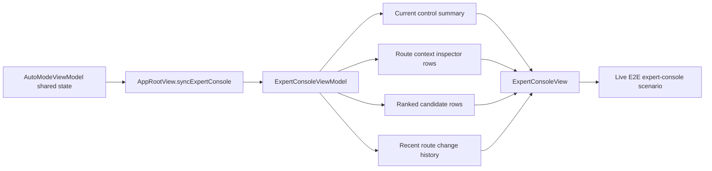

# feat: Plan expert console dashboard and manual control

## Overview

This plan defines Sprint 4 of the network-optimization roadmap: turn `Expert Console` into the power-user dashboard for route context, current control state, alternatives, and recent routing decisions.

Sprint 1 established the tuple vocabulary. Sprint 2 established explicit candidate evaluation. Sprint 3 is expected to make monitoring and switch or hold state durable. Sprint 4 should expose that shared truth clearly in the console without creating a second engine or leaking raw config complexity into the product.

The end-state for this sprint is an `Expert Console` that can answer, for each current route:

- what environment and destination context RockeRoom is reasoning about
- which provider and strategy are currently active
- whether RockeRoom is auto-managing, holding, degraded, or under manual control
- what the best visible alternative is, and why RockeRoom switched or stayed put
- what changed recently, in concise product-legible history

## Problem Frame

The roadmap already fixed the intended role of `Expert Console`: it is the dense power-user surface, while `Home` remains summary-first. The current implementation is structurally correct but still thin.

Today:

- `AppRootView` passes shared snapshot, recommendation, pin, and destination-assignment state into `ExpertConsoleViewModel`
- `ExpertConsoleViewModel` flattens that state into basic current values, destination rows, ranked candidates, evidence rows, and a single control string
- `ExpertConsoleView` renders those sections in a simple list
- there is no dedicated route-context inspector, no recent route-change history, and limited explanation of hold, degraded, or manual-control state

That leaves the console underpowered for the roadmap's intended product role. A user can see rankings and a few badges, but cannot yet inspect the optimizer's decision space in a way that matches the tuple model or the monitoring lifecycle.

If Sprint 4 does not deepen this surface now, later validation work will keep testing a console that exposes less truth than the engine actually knows, and users will continue to infer behavior from scattered labels rather than one coherent dashboard.

## Requirements Trace

- R1. Make `Expert Console` the authoritative power-user dashboard for route evidence, alternatives, and controls.
- R2. Keep one shared truth spine across `Home`, `Expert Console`, automation, and tests.
- R3. Expose route context as first-class console vocabulary: environment, destination, provider, and strategy.
- R4. Make current control state explicit: auto-managed, pinned/manual, hold, switched, or degraded.
- R5. Show recent route-change or hold reasoning in product-legible form without surfacing raw engine internals.
- R6. Preserve observability honesty: curated destinations and route-context explanation, not private per-app inspection or raw config dumps.
- R7. Keep manual controls bound to the same shared state used by `Auto Mode`; no second control model.

## Scope Boundaries

- No new routing engine or evaluator logic in this sprint.
- No raw Clash config editor, giant rule browser, or template-syntax inspector.
- No redesign of `Home` beyond whatever shared-state parity is required to keep surfaces consistent.
- No background optimization claims or lifecycle promises beyond the existing foreground model.
- No full analytics, export, or audit-log subsystem.

## Context & Research

### Relevant Code and Patterns

- `App/ExpertConsole/ExpertConsoleViewModel.swift` already acts as the translation layer from shared runtime state into console-specific row models. This is the natural seam to deepen rather than moving formatting into the view.
- `App/ExpertConsole/ExpertConsoleView.swift` already uses a sectioned list with compact row helpers and candidate badges. Sprint 4 should preserve that presentation pattern while adding richer sections and dedicated subviews.
- `App/AppRootView.swift` already synchronizes `AutoModeViewModel` into `ExpertConsoleViewModel` through one `refresh(...)` seam. Shared-state additions should continue to enter through this path.
- `docs/testing/live-e2e-workflow.md` already treats `expert-console` as a first-class simulator-backed validation scenario. Sprint 4 should extend that contract instead of inventing a separate QA path.
- `App/Automation/LiveE2EScenario.swift` already names `expert-console`, `manual-mode-advisory`, `override-or-pin`, and other routing scenarios that can anchor UI validation.

### Institutional Learnings

- The repo improves when one shared truth model feeds every surface. `Expert Console` should explain the current state, not reinterpret it.
- Product language is strongest when it stays evidence-first and user-legible. The console should expose route context and reasons, not raw engine syntax.
- The app already uses `Home` for summary and `Expert Console` for density. This sprint should deepen that split, not blur it.

### External References

- None required. Existing repo patterns and roadmap decisions are sufficient for this sprint.

## Key Technical Decisions

- **Keep `ExpertConsoleViewModel` as the adapter seam:** enrich the view model with richer row models and explanation strings instead of pushing shared-state formatting into SwiftUI views.
- **Add dedicated console subviews for dense concepts:** route-context inspection and recent route history deserve explicit components rather than being buried in one giant list row.
- **Manual controls remain shared-state driven:** the console should display and invoke the same pin or override semantics already used by `Auto Mode`, not a screen-local control model.
- **Prefer additive shared-state exposure over screen-local caches:** if the console needs richer recent-change context, extend the shared assignment or refresh payload shape rather than inventing local derived persistence.
- **Keep history lightweight and recent:** the sprint only needs enough history to explain recent switch or hold behavior, not a long-lived audit subsystem.

## Open Questions

### Resolved During Planning

- **Should Sprint 4 introduce a second engine or screen-local scoring layer to support richer console visuals?** No. The console must stay downstream of the shared engine and assignment state.
- **Should manual controls expand into raw config editing or route-rule authoring?** No. Sprint 4 stays product-legible and evidence-first.
- **Should route history become a broad persistence project in this sprint?** No. Keep history lightweight and scoped to recent route-change explanation.

### Deferred to Implementation

- **Exact recent-history shape:** implementation can decide whether the minimum useful history is a short list of route-change entries, a current-plus-previous pair, or a small shared payload extension once the Sprint 3 shared state is finalized.
- **Exact visual density of the new console sections:** implementation can tune section layout once the component boundaries are in place.
- **Exact parity path for manual override wording versus current pin-only semantics:** implementation can align naming with the final Sprint 3 control-state model without changing the underlying shared truth spine.

## High-Level Technical Design

> *This illustrates the intended approach and is directional guidance for review, not implementation specification. The implementing agent should treat it as context, not code to reproduce.*

## Implementation Units

- [ ] **Unit 1: Expand console-facing shared state and row models**

**Goal:** Define the richer `ExpertConsoleViewModel` output needed to describe route context, current control state, alternatives, and recent routing changes without putting decision logic into the view layer.

**Requirements:** R1, R2, R3, R4, R7

**Dependencies:** Sprint 3 monitoring and hold-state work must provide stable shared state to read from

**Files:**
- Modify: `App/ExpertConsole/ExpertConsoleViewModel.swift`
- Modify: `App/AppRootView.swift`
- Test: `Tests/ExpertConsoleViewModelTests.swift`
- Test: `Tests/AutoModeViewModelTests.swift`

**Approach:**
- Introduce richer console row models for route context, current control state, best visible alternative, and recent routing events.
- Keep `AppRootView.syncExpertConsole()` as the only handoff seam from `AutoModeViewModel` into the console model.
- If current shared state is insufficient to express recent change history or manual-control nuance, extend the refresh payload additively rather than inventing console-local caching.
- Preserve existing ranked candidate and destination-row behavior while making the tuple vocabulary more explicit.

**Patterns to follow:**
- Follow the adapter-style translation already used in `App/ExpertConsole/ExpertConsoleViewModel.swift`.
- Follow the shared-state sync pattern already used in `App/AppRootView.swift`.

**Test scenarios:**
- Happy path: the view model produces route-context rows with environment, destination, provider, and strategy for the current selection.
- Happy path: current control state is rendered distinctly for auto-managed, pinned/manual, and hold/degraded cases.
- Edge case: missing recent-change history degrades to a clear empty-state explanation rather than hiding the rest of the console.
- Edge case: stale or partial evidence is surfaced as uncertain and does not render fully-current language.
- Integration: after `AppRootView` refreshes from shared state, `Home` and `Expert Console` reflect the same current route and control mode.

**Verification:**
- `ExpertConsoleViewModel` can fully describe the current optimizer state without deriving a second routing model.

- [ ] **Unit 2: Build dedicated route-context inspector and recent-history views**

**Goal:** Break the richer console into focused components that present route context and recent route changes clearly without turning `ExpertConsoleView` into one oversized list body.

**Requirements:** R1, R3, R4, R5, R6

**Dependencies:** Unit 1

**Files:**
- Modify: `App/ExpertConsole/ExpertConsoleView.swift`
- Create: `App/ExpertConsole/RouteContextInspectorView.swift`
- Create: `App/ExpertConsole/RouteChangeHistoryView.swift`
- Test: `Tests/ExpertConsoleViewModelTests.swift`
- Test: `UITests/LiveE2EWorkflowTests.swift`

**Approach:**
- Add focused sections for current route context and recent route history instead of burying that information in existing destination or candidate rows.
- Keep the list-and-section structure already established in `ExpertConsoleView`, but use dedicated subviews where density and reuse justify them.
- Reuse the existing badge and row presentation patterns so the new sections feel native to the current UI.
- Keep labels product-legible: environment, provider, strategy, hold reason, better alternative, and last change should read like explanations, not diagnostics.

**Patterns to follow:**
- Reuse the sectioned list composition already present in `App/ExpertConsole/ExpertConsoleView.swift`.
- Mirror the compact row helper and badge pattern already used for candidates and destinations.

**Test scenarios:**
- Happy path: the route-context inspector renders the current tuple with environment, destination, provider, and strategy.
- Happy path: the recent-history section renders a recent switch or hold explanation in chronological order.
- Edge case: no history renders a clear placeholder without collapsing adjacent sections.
- Edge case: degraded or stale current state shows caution language and does not imply a healthy active route.
- Integration: the `expert-console` live-E2E path can assert that the new sections appear once benchmarked shared state exists.

**Verification:**
- Power users can inspect route context and recent routing decisions directly in the console without scanning unrelated sections.

- [ ] **Unit 3: Tighten manual-control semantics and alternative-route explanation**

**Goal:** Make pin or override state, recommended alternatives, and hold reasoning explicit in the console so the user can tell what RockeRoom would do and why.

**Requirements:** R1, R4, R5, R7

**Dependencies:** Unit 2

**Files:**
- Modify: `App/ExpertConsole/ExpertConsoleViewModel.swift`
- Modify: `App/ExpertConsole/ExpertConsoleView.swift`
- Modify: `App/AppRootView.swift`
- Test: `Tests/ExpertConsoleViewModelTests.swift`
- Test: `UITests/ManualPinFlowTests.swift`
- Test: `UITests/LiveE2EWorkflowTests.swift`

**Approach:**
- Make the current control mode explicit in the console: auto-managed, pinned/manual, holding for safety, or degraded.
- Surface the best visible alternative alongside the current route when that comparison is meaningful, including a short reason for recommendation or non-switch.
- Keep pin and unpin actions bound to the existing `AppRootView` wiring so the console invokes the same shared behavior as `Home` and `Auto Mode`.
- Ensure the console never shows conflicting language such as “recommended” and “manual override active” without explaining which control mode currently wins.

**Patterns to follow:**
- Follow the current callback wiring for pin and unpin actions in `App/ExpertConsole/ExpertConsoleView.swift` and `App/AppRootView.swift`.
- Mirror the explicit hold-reason wording style already used in `App/ExpertConsole/ExpertConsoleViewModel.swift` and `Shared/Engine/RecommendationPolicy.swift`.

**Test scenarios:**
- Happy path: when a better alternative exists, the console shows both the current route and the alternative with a human-legible reason.
- Happy path: pinning from the console updates control-state language to manual or pinned and suppresses conflicting auto-copy.
- Edge case: a hold for low confidence, stale evidence, or insignificant gain is rendered with the correct reason and no switch language.
- Edge case: a manual-control session still shows alternatives for inspection without implying RockeRoom will auto-apply them.
- Integration: pin and unpin flows from the console preserve parity between `Home` and `Expert Console` after the shared state refreshes.

**Verification:**
- Users can tell whether RockeRoom is in control, why it is holding or switching, and what the next best route would be.

- [ ] **Unit 4: Lock Sprint 4 console behavior into tests and simulator-backed validation docs**

**Goal:** Make the richer console contract durable so later validation and release hardening work inherits one authoritative dashboard model.

**Requirements:** R1, R2, R5, R6, R7

**Dependencies:** Unit 3

**Files:**
- Create: `Tests/ExpertConsoleViewModelTests.swift`
- Modify: `UITests/LiveE2EWorkflowTests.swift`
- Modify: `UITests/ManualPinFlowTests.swift`
- Modify: `docs/testing/live-e2e-workflow.md`
- Modify: `docs/plans/2026-04-05-006-feat-network-optimization-roadmap-plan.md`

**Approach:**
- Add dedicated view-model tests for the richer console rows, control-state wording, and degraded or empty-state behavior.
- Extend the simulator-backed workflow checks so `expert-console` validates route context, recent change explanation, and manual-control state instead of only ranked candidates.
- Keep the roadmap and validation docs honest about Sprint 4 boundaries: richer console explanation is in; new engine behavior is not.
- Use the existing launch-driven `expert-console` scenario contract as the primary validation seam.

**Patterns to follow:**
- Follow the contract-tightening style already used in the routing test files and roadmap docs.
- Reuse the current launch-driven scenario language in `docs/testing/live-e2e-workflow.md`.

**Test scenarios:**
- Happy path: dedicated console tests prove current route context, control state, and recent change summaries render from shared state.
- Happy path: the `expert-console` UI test asserts the new inspector and recent-history sections appear for a benchmarked session.
- Edge case: empty or degraded history state keeps the console usable and explicitly marked as limited.
- Integration: the live workflow documents and tests describe the same console contract the implementation exposes.
- Test expectation: none for non-behavioral roadmap wording beyond review confirmation that Sprint 4 boundaries and terminology remain aligned.

**Verification:**
- The repo's tests and validation docs describe `Expert Console` as the authoritative inspection surface for current route context and manual control state.

## System-Wide Impact

- **Interaction graph:** `AutoModeViewModel` continues to own runtime truth, `AppRootView` continues to synchronize it, and `ExpertConsoleViewModel` continues to adapt it for the console. New console components must stay downstream of that flow.
- **Error propagation:** missing or degraded routing state should soften into explicit empty or degraded console sections rather than crashing, hiding the console, or manufacturing certainty.
- **State lifecycle risks:** if recent route history is added to shared state, restore semantics must stay coherent so the console and `Home` agree after relaunch.
- **API surface parity:** pin, unpin, hold, and current-route explanations must stay consistent between `Home`, `Expert Console`, simulator scenarios, and tests.
- **Integration coverage:** view-model tests alone are not enough; simulator-backed workflow checks must prove the richer console appears from the same launch-driven state contract.
- **Unchanged invariants:** `Home` remains summary-first, `Expert Console` remains the dense inspection surface, foreground-only monitoring honesty remains fixed, and no raw config editor is introduced.

## Risks & Dependencies

| Risk | Mitigation |
|------|------------|
| The console grows a screen-local explanation model that drifts from shared routing state | Keep `AppRootView` and `ExpertConsoleViewModel` as the only state handoff seam and avoid view-local inference |
| Route history scope expands into a persistence project that delays the sprint | Keep history lightweight and recent, only deep enough to explain current or recent actions |
| Manual-control language becomes inconsistent across `Home` and `Expert Console` | Add parity-focused tests and route all control state through shared view-model refresh inputs |
| The UI becomes dense but less legible | Split the console into dedicated subviews and keep labels evidence-first and product-legible |

## Documentation / Operational Notes

- Treat Sprint 4 as the dashboard-explanation sprint, not the engine-behavior sprint.
- Update the live-E2E workflow checks for `expert-console` so simulator validation proves the richer dashboard contract directly.
- If Sprint 3 finalizes a different shared shape for recent hold or switch history, keep this plan's console vocabulary aligned with that shared model rather than adding adapter-only concepts.

## Sources & References

- **Origin document:** `docs/plans/2026-04-05-006-feat-network-optimization-roadmap-plan.md`
- Related requirements: `docs/brainstorms/2026-04-05-network-optimization-product-direction-requirements.md`
- Related plans: `docs/plans/2026-04-05-007-feat-route-context-foundations-plan.md`, `docs/plans/2026-04-05-008-feat-route-candidate-evaluation-plan.md`, `docs/plans/2026-04-05-009-feat-auto-mode-monitoring-and-switching-plan.md`
- Related code: `App/ExpertConsole/ExpertConsoleView.swift`, `App/ExpertConsole/ExpertConsoleViewModel.swift`, `App/AppRootView.swift`, `App/Automation/LiveE2EScenario.swift`
- Validation contract: `docs/testing/live-e2e-workflow.md`
